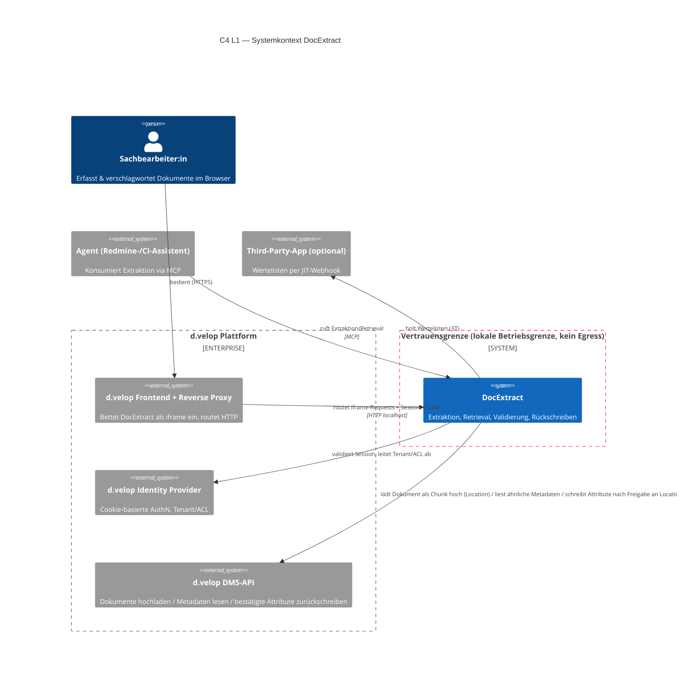
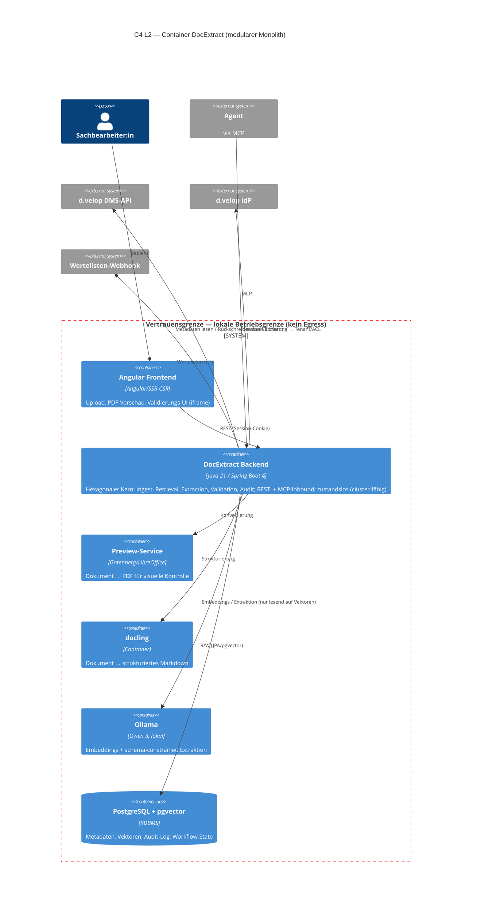
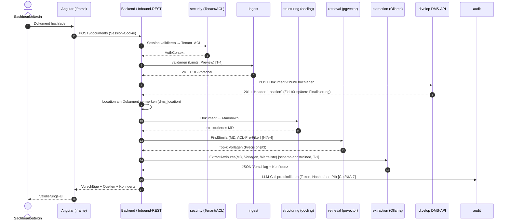
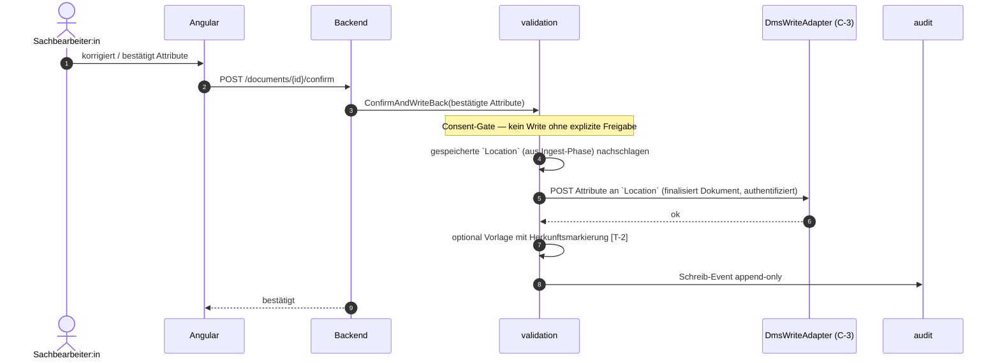
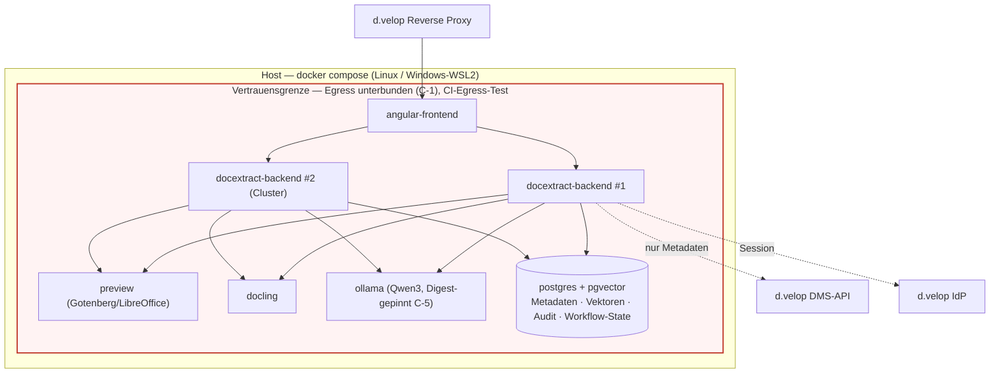
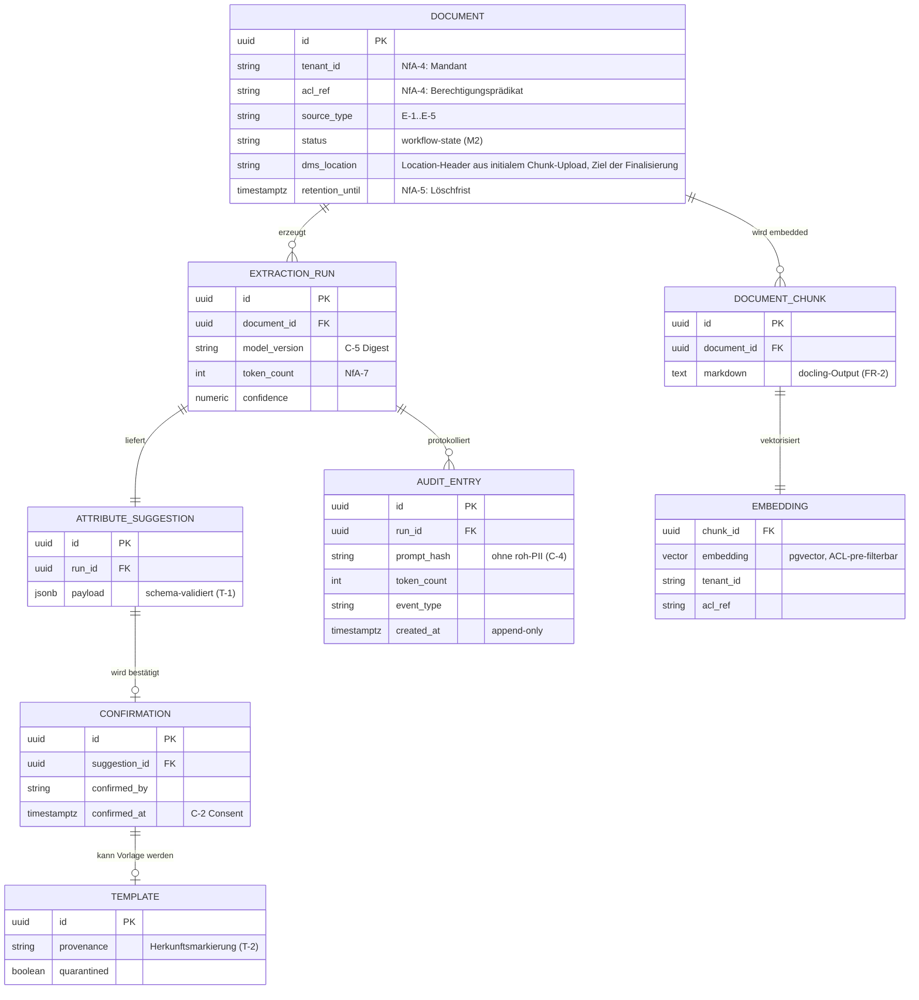

# ARCHITECTURE — DocExtract

**KI-gestützte Dokumenterfassung & -verschlagwortung für d.velop documents**
Architektur-Kontext-Dokument (KI-Rahmen) · Gliederung in Anlehnung an **arc42** · Diagramme in **C4 (Mermaid)**
Bezugsdokument: [SPEC.md](SPEC.md) · Blockplanung: [PROJEKTPLAN.md](PROJEKTPLAN.md) · Entscheidungen: § 9 (ADRs)
**Stand:** 09/2026 · **Status:** lebendes Dokument, versioniert pro Block (v0.1 → v1.0)

---

## 0. Wie dieses Dokument das Bewertungsraster bedient (Traceability)

Dieses Kapitel ist die Landkarte für Korrektur und Präsentation. Es bildet die relevanten Rasterkriterien auf die Abschnitte ab, damit jede geforderte Perspektive nachweisbar ist.

| Rasterkriterium (Gruppe)                                             | Erwartung                             | Abschnitt in diesem Dokument                                           |
| -------------------------------------------------------------------- | ------------------------------------- | ---------------------------------------------------------------------- |
| **Entwurf (4)** Lösungsansatz/Architektur bildlich + textuell        | C4-Sichten + Prosa                    | § 3 (Kontext L1), § 5 (Container L2 + Paketstruktur), § 7 (Deployment) |
| **Entwurf (5)** Perspektiven Struktur · Verhalten · Interaktion      | Alle drei sichtbar                    | § 5 (Struktur), § 6 (Verhalten/Runtime), § 3 (Interaktion/Kontext)     |
| **Entwurf (6)** Datenmodell spezifiziert                             | ER-/Schemamodell                      | § 8.4 (Datenmodell + Migrationen)                                      |
| **Programmierung (7)** Schichten/Module, Verantwortlichkeiten        | Hexagonal + Modulschnitt              | § 4, § 5.2, § 5.3                                                      |
| **Programmierung (8)** Framework-Konzepte (DI, REST, Config, Fehler) | Spring-Boot-Idiome                    | § 8.1–8.3                                                              |
| **Validierung (12)** Test-/Sicherheitsstrategie                      | Teststufen + Threat-Mitigation        | § 10                                                                   |
| **KI & Architektur (16)** substanzielle KI-Funktion abgesichert      | Retrieval + Extraktion + Guardrails   | § 6.2, § 8.5, § 10.3                                                   |
| **KI & Architektur (17)** Modulgrenzen, containerlauffähig           | Modularer Monolith, Compose           | § 4, § 5, § 7                                                          |
| **KI & Architektur (18)** Reflexion/Veto                             | 3 bewusst nicht delegierte Entscheide | § 9 (ADRs) + § 11                                                      |

_Grundlage: Bewertungsraster (18 Kriterien / 100 Punkte) und Aufgabenstellung Projektarbeit (arc42 empfohlen, C4 L1/L2 Pflicht, ADRs für die wichtigsten Entscheidungen)._

---

## 1. Einführung und Ziele (arc42 §1)

DocExtract erfasst und verschlagwortet eingehende Dokumente **ohne manuelles Abtippen** und legt sie nach menschlicher Freigabe im DMS (d.velop documents) ab — schnell, nachvollziehbar, datensouverän. Fachliche Vision, Stakeholder und Kernfunktionen sind in [SPEC.md § 1 / § 5.1](SPEC.md) definiert; dieses Dokument beschreibt **wie** die Lösung strukturell, verhaltensseitig und im Betrieb aufgebaut ist.

### 1.1 Wichtigste Qualitätsziele (verkürzt, Details SPEC § 3)

| Prio | Qualitätsziel                             | Architektonischer Treiber                                            |
| ---- | ----------------------------------------- | -------------------------------------------------------------------- |
| 1    | **Datensouveränität** (NfA-5, C-1)        | Alle Verarbeitung innerhalb der Vertrauensgrenze; Egress unterbunden |
| 2    | **Mandanten-/ACL-Isolation** (NfA-4, T-3) | Berechtigungs-Pre-Filter im Retrieval, aus Session abgeleitet        |
| 3    | **Extraktionsgüte** (NfA-1)               | Schema-constrained Decoding, Retrieval-gestützte Prompts             |
| 4    | **Effizienz p95** (NfA-2)                 | Pipeline mit Stufen-Timeouts, cluster-fähiger, zustandsloser Kern    |
| 5    | **Nachvollziehbarkeit** (C-4)             | Append-only Audit-Log ohne roh-PII                                   |

### 1.2 Architektonisch relevante Stakeholder

Sachbearbeiter:in (UI-Pfad), Agent (MCP-Pfad), Records-/DMS-Owner, IT-Betrieb/Datenschutz, d.velop als Plattform — Interessen siehe [SPEC.md § 1](SPEC.md).

---

## 2. Randbedingungen (arc42 §2)

| Typ         | Randbedingung                                                                                                                               | Quelle                     |
| ----------- | ------------------------------------------------------------------------------------------------------------------------------------------- | -------------------------- |
| Technisch   | Java 21 · Spring Boot 4 · Angular (iframe) · pgvector/PostgreSQL · docling · Ollama · Docker Compose                                        | SPEC § 4 (Empfehlung)      |
| Integration | App läuft **als iframe hinter d.velop Reverse Proxy** auf lokalem HTTP-Endpunkt; AuthN via **d.velop-Cookie/Session** (keine Impersonation) | SPEC § 4                   |
| Betrieb     | Reproduzierbar per `docker compose up` auf Linux **und** Windows/WSL2; **Cluster-Modus** (mehrere Instanzen, gemeinsame Datenhaltung)       | SPEC § 5.2 C-6             |
| Sicherheit  | Egress technisch unterbunden + CI-Egress-Test; Least Privilege; Digest-Pinning; append-only Audit                                           | SPEC § 5.2 C-1/C-3/C-4/C-5 |
| Prozess     | Projekt-Kontext-Dokument versioniert; ADRs für Grundentscheide; arc42 empfohlen                                                             | Projektarbeit Block 1–5    |

---

## 3. Kontextabgrenzung — C4 Level 1 (arc42 §3 / Perspektive: Interaktion)

**Textuell:** Die Sachbearbeiter:in bedient DocExtract ausschliesslich im Browser über das **d.velop-Frontend**, das die App als iframe einbettet; der **Reverse Proxy** routet auf den lokalen HTTP-Endpunkt. Ein zweiter Konsument, ein **Agent**, nutzt denselben Kern über ein **MCP-Tool** — mit identischen Guardrails. Nach aussen fliessen **nur** Metadaten-Lese-/Schreibzugriffe auf die DMS-API sowie JIT-Wertelisten-Abrufe; Dokumentinhalte und Embeddings verlassen die Vertrauensgrenze nie (C-1).



> **Vertrauensgrenze (rot):** Alles innerhalb `System_Boundary tb` — docling, Embeddings, Ollama-Inferenz, pgvector — bleibt lokal. Kontrollierter Ausgang nur zu IdP, DMS-API und Wertelisten-Webhook.

### 3.1 Externe Schnittstellen

| Nachbarsystem          | Richtung | Protokoll     | Zweck                                                                                                                                                      | Sicherheitsnote                                                                                     |
| ---------------------- | -------- | ------------- | ---------------------------------------------------------------------------------------------------------------------------------------------------------- | --------------------------------------------------------------------------------------------------- |
| d.velop Frontend/Proxy | in       | HTTP (iframe) | UI-Auslieferung + REST                                                                                                                                     | Session-Cookie durchgereicht                                                                        |
| d.velop IdP            | out      | HTTP          | Session → Tenant/ACL-Prädikate                                                                                                                             | Basis für NfA-4                                                                                     |
| d.velop DMS-API        | in/out   | HTTP          | Zweiphasig: (1) Dokument-Chunk hochladen → `Location` im Response-Header, (2) nach Freigabe Attribute an diese `Location` schreiben (finalisiert Dokument) | Finaler Write **nur** nach Consent (C-2); `Location` wird bis zur Freigabe serverseitig vorgehalten |
| Third-Party-App        | out      | Webhook (JIT) | Wertelisten                                                                                                                                                | Client-only, kein Import                                                                            |
| Agent                  | in       | MCP           | Extraktion/Retrieval                                                                                                                                       | Minimal-Scopes (C-3), Consent (T-6)                                                                 |

---

## 4. Lösungsstrategie (arc42 §4)

| Qualitätsziel                           | Lösungsansatz                                                                                                  | Muster                        |
| --------------------------------------- | -------------------------------------------------------------------------------------------------------------- | ----------------------------- |
| Wartbarkeit, klare Verantwortlichkeiten | **Modularer Monolith** mit **Hexagonaler Architektur** (Ports & Adapters); Fachmodule mit expliziten Verträgen | Ports & Adapters, DDD-Schnitt |
| Datensouveränität (C-1)                 | Alle KI-/Datenpfade in lokalen Containern; Egress-Policy + CI-Test                                             | Deployment-Isolation          |
| ACL-Isolation (NfA-4)                   | Berechtigungs-**Pre-Filter** als Query-Prädikat, nicht Post-Filter                                             | Security-in-depth             |
| Skalierung (Cluster)                    | **Zustandsloser** Applikationskern; Zustand ausschliesslich in Postgres/pgvector                               | Shared-Data, Stateless-App    |
| Agent-Konsum ohne UI-Bruch              | Fachlogik hinter Inbound-Ports; **REST-Adapter** und **MCP-Adapter** teilen denselben Application-Service      | Adapter-Symmetrie             |

**Grundentscheid (siehe ADR-001):** kein Microservice-Split — keine nichtfunktionale Anforderung (Last, unabhängige Deploybarkeit, Team-Topologie) rechtfertigt die Verteilungskosten. Cluster-Betrieb wird durch **Zustandslosigkeit + gemeinsame Datenhaltung** erreicht, nicht durch Service-Zerlegung.

---

## 5. Bausteinsicht — C4 Level 2 (arc42 §5 / Perspektive: Struktur)

### 5.1 Container-Diagramm (L2)



### 5.2 Fachmodule (Bausteine der Ebene 3)

| Modul                      | Verantwortung                                                                                                 | Inbound-Port          | Wichtigste Outbound-Ports                                                                      |
| -------------------------- | ------------------------------------------------------------------------------------------------------------- | --------------------- | ---------------------------------------------------------------------------------------------- |
| **ingest**                 | Upload, Eingangsvalidierung, Limits, Preview, initialer DMS-Chunk-Upload inkl. `Location` (FR-1)              | `IngestDocument`      | `PreviewPort`, `DmsChunkUploadPort` (liefert `Location`)                                       |
| **structuring**            | docling-Aufbereitung → Markdown (FR-2)                                                                        | `StructureDocument`   | `StructuringPort`                                                                              |
| **retrieval**              | Embedding + Ähnlichkeitssuche mit **ACL-Pre-Filter** (FR-3, NfA-4/-6)                                         | `FindSimilar`         | `EmbeddingPort`, `VectorSearchPort`, `AuthContextPort`                                         |
| **extraction**             | Schema-constrained LLM-Attributvorschläge (FR-4, T-1)                                                         | `ExtractAttributes`   | `LlmPort`, `ValueListPort`                                                                     |
| **validation**             | Human-in-the-Loop, finales Attribut-Rückschreiben an die zuvor erhaltene `Location` nach Freigabe (FR-5, C-2) | `ConfirmAndWriteBack` | `DmsWritePort` (separater, authentifizierter Adapter, C-3; adressiert `Location` aus `ingest`) |
| **agentgateway**           | MCP-Tool, teilt Application-Services (FR-6, T-6)                                                              | `McpTool`             | dieselben wie UI-Pfad                                                                          |
| **audit** (Querschnitt)    | Append-only Protokoll, Token-/Kosten-Erfassung (C-4, NfA-7)                                                   | —                     | `AuditLogPort`                                                                                 |
| **security** (Querschnitt) | Session→Tenant/ACL-Auflösung, Consent-Gate                                                                    | `AuthContextPort`     | —                                                                                              |

### 5.3 Paketstruktur (Perspektive: Struktur, textuell)

```

com.adeon.docextract
├─ ingest
│ ├─ domain # DocumentUpload, Limits, ValidationResult, DmsLocation
│ ├─ application # IngestDocumentService (Inbound-Port-Impl, ruft DmsChunkUploadPort)
│ └─ adapter
│ ├─ in.rest # UploadController (REST)
│ ├─ out.preview # GotenbergPreviewAdapter
│ └─ out.dms # DmsChunkUploadAdapter (POST Chunk → liest `Location`-Header)
├─ structuring
│ ├─ application
│ └─ adapter.out.docling
├─ retrieval
│ ├─ domain # SimilarityQuery, AclPredicate, RetrievalResult
│ ├─ application # FindSimilarService (ACL-Pre-Filter!)
│ └─ adapter.out # PgVectorSearchAdapter, OllamaEmbeddingAdapter
├─ extraction
│ ├─ domain # AttributeSchema, ExtractionResult, Confidence
│ ├─ application # ExtractAttributesService (schema-constrained)
│ └─ adapter.out # OllamaLlmAdapter, ValueListWebhookAdapter
├─ validation
│ ├─ domain # ConfirmedAttributes, Provenance
│ ├─ application # ConfirmAndWriteBackService (Consent-Gate C-2, adressiert gespeicherte `Location`)
│ └─ adapter.out.dms # DmsWriteAdapter (POST Attribute an `Location`, separater Dienst, C-3)
├─ agentgateway
│ └─ adapter.in.mcp # McpToolServer (teilt application-Services)
├─ audit # append-only, ohne roh-PII (C-4)
├─ security # AuthContext, TenantAclResolver, ConsentGuard
└─ shared # Fehlerbehandlung, Config, Observability

```

**Verantwortlichkeitsprinzip:** Domäne kennt keine Frameworks; Adapter kennen keine Fachregeln; die `security`- und `audit`-Querschnitte werden über Spring-DI und Aspekte eingezogen, sodass jeder Inbound-Pfad (REST **und** MCP) dieselben Guardrails durchläuft.

---

## 6. Laufzeitsicht (arc42 §6 / Perspektive: Verhalten & Interaktion)

### 6.1 Happy-Path — Upload bis Vorschlag (UI)



### 6.2 Freigabe & Rückschreiben (Human-in-the-Loop, C-2)



### 6.3 Agent-Pfad (MCP) — gleiche Guardrails

Der Agent ruft dasselbe `ExtractAttributes`/`FindSimilar` über den **MCP-Adapter**. Kritische Aktionen (DMS-Write) sind auch hier **consent-pflichtig** (T-6): Das MCP-Tool liefert Vorschläge, ein Schreibvorgang erfordert einen expliziten Freigabeschritt und minimale Scopes (C-3). Fehlerinjektion (ungültiges LLM-JSON, docling-Absturz) endet in einem **protokollierten, sauberen Fehlerzustand** (NfA-3).

---

## 7. Verteilungssicht (arc42 §7 / Deployment)



- **Cluster-fähig:** N Backend-Instanzen hinter dem Proxy, gemeinsame DB; keine Sticky Sessions nötig (zustandslos).
- **Reproduzierbar (C-6):** `docker compose up`, Basis-Images per **Digest** fixiert, Modelle per Digest-Pinning (T-5/C-5).
- **CI-Gate:** Smoke- + **Egress-Test** (LLM als Mock), Security-Scan (SAST/Dependency/Image) vor Publish.

---

## 8. Querschnittliche Konzepte (arc42 §8)

### 8.1 Framework-Konzepte (Spring Boot 4)

- **Dependency Injection** trennt Ports von Adaptern; Querschnitte (`security`, `audit`) via DI/Aspekte an jedem Inbound-Pfad.
- **REST**: Ressourcenorientierte Controller, OpenAPI-spezifiziert (Block 3), Fehlerfälle als `ProblemDetail` (RFC 9457).
- **Konfiguration**: `application.yml` + Umgebungsprofile (`local`, `ci`, `cluster`); Secrets nie im Image.
- **Fehlerbehandlung**: zentraler `@ControllerAdvice`; jede Pipeline-Stufe mit eigenem Timeout und definiertem Abbruch (T-4 → NfA-3).

### 8.2 Sicherheit (Überblick, Details § 10.3)

Session-basierte AuthN (d.velop-Cookie) → **Tenant/ACL-Auflösung** → Pre-Filter im Retrieval → Consent-Gate vor irreversiblen Aktionen → append-only Audit ohne roh-PII. Least Privilege: LLM **liest** nur Vektoren; Schreiben über separaten Dienst.

### 8.3 Observability

Strukturiertes Logging pro Pipeline-Stufe (Latenz je Stufe → NfA-2), Metriken (Micrometer/Prometheus), Traces (OpenTelemetry). **KI-Betriebsdaten**: Modell-/Prompt-Version, Token/Kosten, Eval-Resultat, Guardrail-Events.

### 8.4 Datenmodell (arc42 / Krit. 6 — Perspektive: Struktur)



**Migrationsstrategie:** versionierte SQL-Migrationen (Flyway/Liquibase); pgvector-Index (HNSW/IVFFlat) mit `tenant_id`/`acl_ref` als Filterspalten, damit der **Pre-Filter** Teil der Query, nicht ein Post-Filter ist. Löschpfad (NfA-5) kaskadiert Dokument + Chunks + Embeddings; Audit bleibt referenzierend (Hashes) erhalten.

### 8.5 KI-Integration (Krit. 16 — substanzielle, abgesicherte KI-Funktion)

- **Retrieval (FR-3):** lokales Embedding, pgvector-Suche **nach** ACL-Pre-Filter → Precision@3 (NfA-6).
- **Extraktion (FR-4):** schema-constrained Decoding gegen JSON-Schema; Werteliste als erlaubte Domäne; „unbekannt" statt Halluzination (E-5).
- **Absicherung:** Dokument strikt als _untrusted data_ (T-1), keine ableitbaren Tool-Calls (C-2), Least Privilege (C-3), append-only Audit (C-4).

---

## 9. Architekturentscheidungen — ADRs (arc42 §9 / Krit. 18: bewusst nicht delegiert)

Diese drei Entscheidungen wurden **nicht an die KI delegiert**; sie tragen die Modulbotschaft (Entwerfen/Prüfen statt Implementieren).

### ADR-001 — Modularer Monolith statt Microservices

- **Status:** akzeptiert · **Kontext:** Trennung von Frontend/Services/Persistenz gefordert, aber keine NfA zu unabhängiger Skalierung/Deployment.
- **Entscheidung:** Ein deploybarer, **zustandsloser** Monolith mit hexagonalen Fachmodulen; Cluster über gemeinsame Datenhaltung.
- **Begründung (gemessen an Qualität):** Wartbarkeit & Latenz (kein Netz-Hop zwischen Modulen, NfA-2) schlagen Verteilungsflexibilität; Microservices würden Betriebs-/Konsistenzkosten ohne NfA-Nutzen erzeugen.
- **Konsequenz:** Modulgrenzen müssen im Code hart bleiben (Paketstruktur, Verträge), damit ein späterer Split möglich bliebe.

### ADR-002 — Berechtigungs-Pre-Filter im Retrieval (nicht Post-Filter)

- **Status:** akzeptiert · **Kontext:** Cross-Tenant-/Cross-ACL-Leak (T-3, NfA-4). Reine Vektorähnlichkeit kennt keine Berechtigung.
- **Entscheidung:** Tenant/ACL-Prädikate aus der Session werden **als Filter in die Vektor-Query** eingebettet.
- **Begründung:** Post-Filter kann Treffer bereits „gesehen" haben (Timing/Ranking-Leak); Pre-Filter garantiert **0 Fremdtreffer** und ist testbar (Cross-Tenant-Test).
- **Konsequenz:** Embeddings tragen `tenant_id`/`acl_ref`; Index muss filterfähig sein.

### ADR-003 — Human-in-the-Loop mit hartem Consent-Gate (auch für MCP)

- **Status:** akzeptiert · **Kontext:** Irreversible DMS-Writes; Agent kann Aufrufe verketten (T-6).
- **Entscheidung:** **Keine** LLM-Ausgabe löst selbsttätig einen Schreib-/Tool-Call aus; Write nur nach expliziter menschlicher Freigabe — UI **und** MCP identisch (C-2).
- **Begründung:** Datenschutz/Integrität vor Komfort; ein einziger, gemeinsamer Application-Service erzwingt das Gate für beide Inbound-Pfade.
- **Konsequenz:** Adapter-Symmetrie; `DmsWriteAdapter` ist der einzige Schreibpfad, separat authentifiziert (C-3). Der initiale Chunk-Upload beim Ingest (liefert `Location`) legt lediglich einen unbestätigten Rohdatensatz ohne Attribute an und gilt **nicht** als irreversibler Write; erst die attribut-tragende Finalisierung an dieser `Location` erfordert das Consent-Gate.

> Weitere ADRs pro Block: Präsentationsschicht (Block 2), Kommunikations-/Async-Entscheid (Block 3), Vektor-DB-Integration & Persistenzmuster (Block 4).

---

## 10. Test-, Sicherheits- und Betriebsstrategie (arc42 §11 / Raster Validierung)

### 10.1 Teststrategie (Krit. 12/13)

| Stufe            | Umfang                                                               | Bezug          |
| ---------------- | -------------------------------------------------------------------- | -------------- |
| Unit             | Domänenlogik (Limits, Schema-Validierung, ACL-Prädikat)              | FR-1/-3/-4     |
| Integration      | Adapter (pgvector, docling, Ollama-Mock)                             | § 5.2          |
| Fehlerinjektion  | ungültiges LLM-JSON, docling-Absturz, OCR-Müll → sauberer Endzustand | NfA-3          |
| Cross-Tenant/ACL | automatisierter Zugriffstest, 0 Fremdtreffer                         | NfA-4          |
| Eval (KI)        | Soll/Ist-JSON gegen Eval-Set (M2 provisorisch, M3 belastbar)         | NfA-1/-2/-6/-7 |

### 10.2 Abnahmekriterien (Krit. 11)

Pro Kernfunktion FR-1…FR-6 ein prüfbares Exit-Kriterium (siehe SPEC § 7 Meilensteine M1–M3); KI-Funktion zusätzlich mit Eval-Qualität, Latenz p95, Kostenindikator und Guardrail-Verhalten.

### 10.3 Bedrohungsmodell (Zusammenfassung SPEC § 6)

T-1 Prompt Injection → schema-constrained + untrusted data · T-2 Datenvergiftung → Freigabe + Herkunft/Quarantäne · T-3 ACL-Leak → Pre-Filter · T-4 DoS → Limits/Timeouts · T-5 Modellmanipulation → Digest-Pinning · T-6 MCP-Missbrauch → Consent + minimale Scopes.

### 10.4 DevSecOps-Gate

Mind. ein automatischer Security-Check (SAST/Dependency/Secret/Image/IaC) mit interpretiertem Befund; Publish erst nach bestandenem Gate.

---

## 11. Risiken & technische Schulden (arc42 §11)

- **iGPU-Inferenzlatenz** kann NfA-2 (p95) für E-4 gefährden → Modellwahl/Chunking als Stellhebel, in M2 messen.
- **Self-Learning-Loop** (Ausbaustufe) birgt Datenvergiftungsrisiko → bewusst hinter Freigabe/Quarantäne, in Block-Iterationen verfeinern.
- **Modulgrenzen im Monolith** können erodieren → ArchUnit-Tests zur Durchsetzung der Paketabhängigkeiten empfohlen.

---

## 12. Glossar (arc42 §12)

**ACL-Pre-Filter** – Berechtigungsprädikat als Teil der Vektor-Query · **Guardrail** – unverhandelbare Leitplanke für den KI-Anteil · **Vertrauensgrenze** – lokale Betriebsgrenze ohne Egress (C-1) · **HITL** – Human-in-the-Loop · **MCP** – Model Context Protocol (Agent-Schnittstelle). Weitere Begriffe siehe [SPEC.md](SPEC.md).
