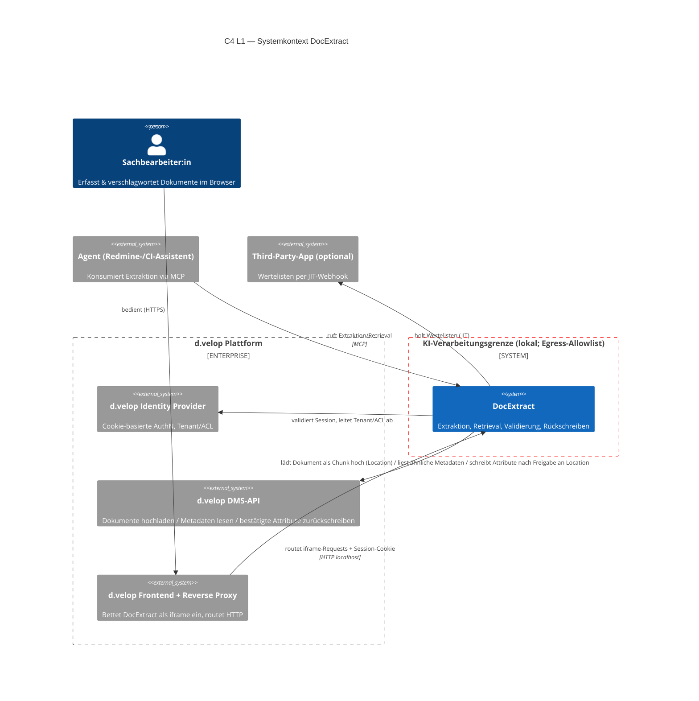
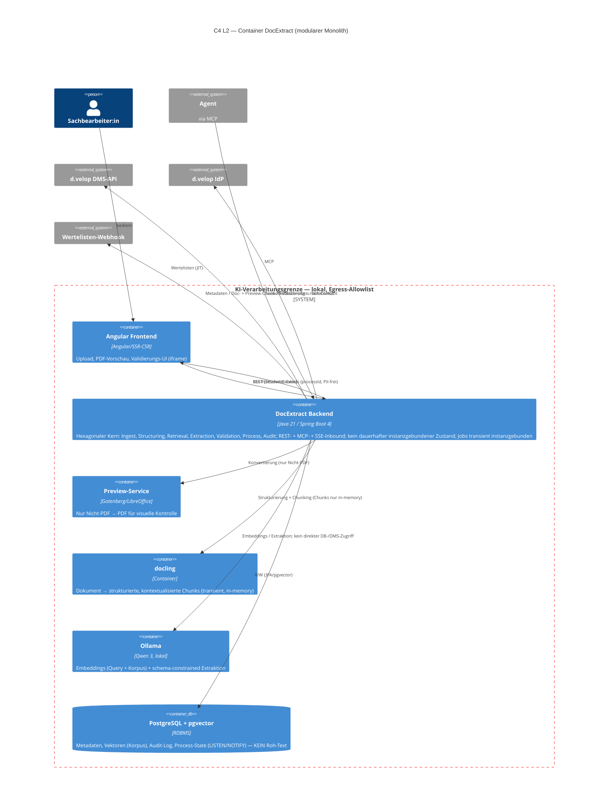
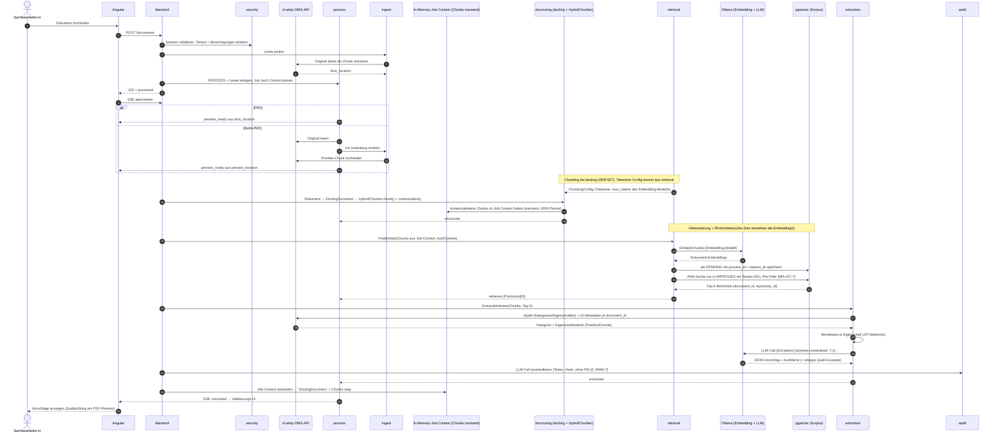
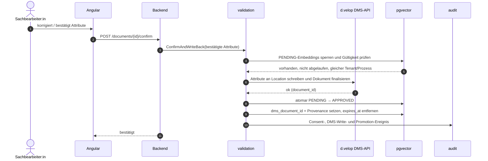
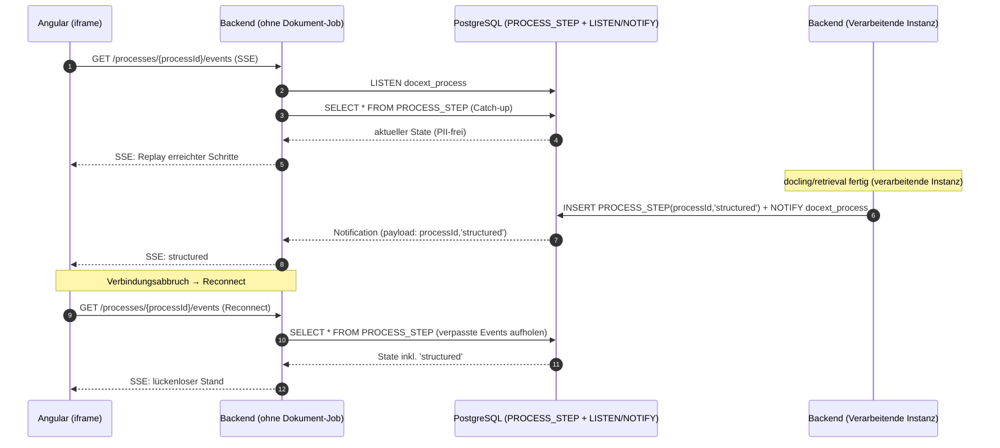
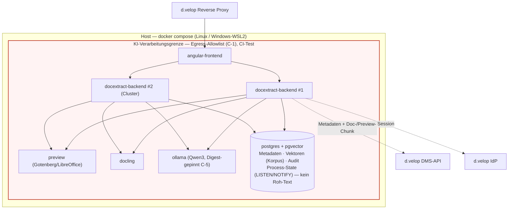
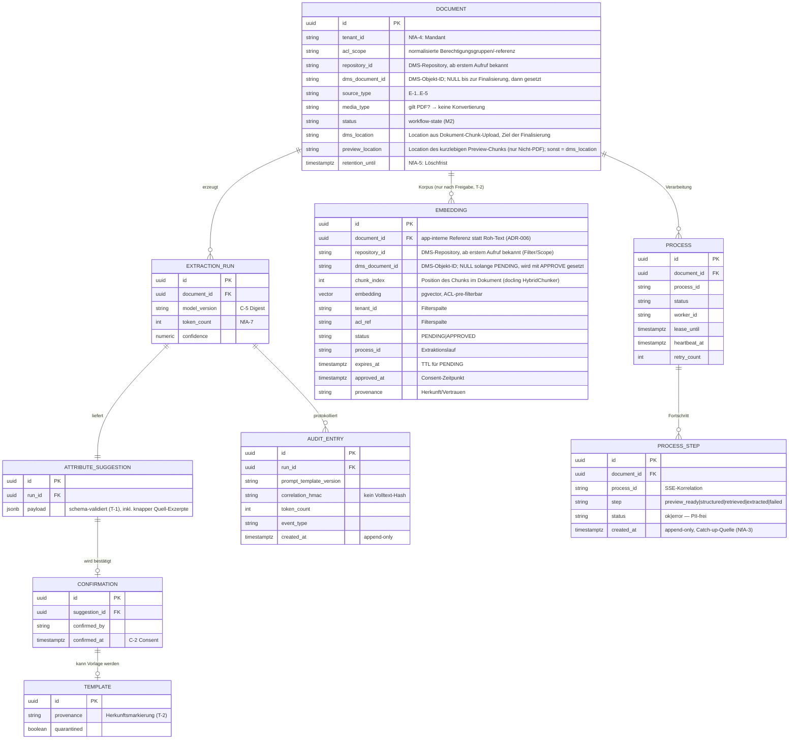

# ARCHITECTURE — DocExtract

**KI-gestützte Dokumenterfassung & -verschlagwortung für d.velop documents**
Architektur-Kontext-Dokument (KI-Rahmen) · Gliederung in Anlehnung an **arc42** · Diagramme in **C4 (Mermaid)**
Bezugsdokument: [SPEC.md](SPEC.md) · Blockplanung: [PROJEKTPLAN.md](PROJEKTPLAN.md) · Entscheidungen: § 9 (ADRs)
**Stand:** 09/2026 · **Status:** lebendes Dokument, versioniert pro Block (v0.1 → v1.0)

---

## 0. Wie dieses Dokument das Bewertungsraster bedient (Traceability)

Dieses Kapitel ist die Landkarte für Korrektur und Präsentation. Es bildet die relevanten Rasterkriterien auf die Abschnitte ab, damit jede geforderte Perspektive nachweisbar ist.

| Rasterkriterium (Gruppe)                                             | Erwartung                             | Abschnitt in diesem Dokument                                           |
| -------------------------------------------------------------------- | ------------------------------------- | ---------------------------------------------------------------------- |
| **Entwurf (4)** Lösungsansatz/Architektur bildlich + textuell        | C4-Sichten + Prosa                    | § 3 (Kontext L1), § 5 (Container L2 + Paketstruktur), § 7 (Deployment) |
| **Entwurf (5)** Perspektiven Struktur · Verhalten · Interaktion      | Alle drei sichtbar                    | § 5 (Struktur), § 6 (Verhalten/Runtime), § 3 (Interaktion/Kontext)     |
| **Entwurf (6)** Datenmodell spezifiziert                             | ER-/Schemamodell                      | § 8.4 (Datenmodell + Migrationen)                                      |
| **Programmierung (7)** Schichten/Module, Verantwortlichkeiten        | Hexagonal + Modulschnitt              | § 4, § 5.2, § 5.3                                                      |
| **Programmierung (8)** Framework-Konzepte (DI, REST, Config, Fehler) | Spring-Boot-Idiome                    | § 8.1–8.3                                                              |
| **Validierung (12)** Test-/Sicherheitsstrategie                      | Teststufen + Threat-Mitigation        | § 10                                                                   |
| **KI & Architektur (16)** substanzielle KI-Funktion abgesichert      | Retrieval + Extraktion + Guardrails   | § 6.2, § 8.5, § 10.3                                                   |
| **KI & Architektur (17)** Modulgrenzen, containerlauffähig           | Modularer Monolith, Compose           | § 4, § 5, § 7                                                          |
| **KI & Architektur (18)** Reflexion/Veto                             | 3 bewusst nicht delegierte Entscheide | § 9 (ADRs) + § 11                                                      |

_Grundlage: Bewertungsraster (18 Kriterien / 100 Punkte) und Aufgabenstellung Projektarbeit (arc42 empfohlen, C4 L1/L2 Pflicht, ADRs für die wichtigsten Entscheidungen)._

---

## 1. Einführung und Ziele (arc42 §1)

DocExtract erfasst und verschlagwortet eingehende Dokumente **ohne manuelles Abtippen** und legt sie nach menschlicher Freigabe im DMS (d.velop documents) ab — schnell, nachvollziehbar, datensouverän. Fachliche Vision, Stakeholder und Kernfunktionen sind in [SPEC.md § 1 / § 5.1](SPEC.md) definiert; dieses Dokument beschreibt **wie** die Lösung strukturell, verhaltensseitig und im Betrieb aufgebaut ist.

### 1.1 Wichtigste Qualitätsziele (verkürzt, Details SPEC § 3)

| Prio | Qualitätsziel                             | Architektonischer Treiber                                            |
| ---- | ----------------------------------------- | -------------------------------------------------------------------- |
| 1    | **Datensouveränität** (NfA-5, C-1)        | Alle Verarbeitung innerhalb der Vertrauensgrenze; Egress unterbunden |
| 2    | **Mandanten-/ACL-Isolation** (NfA-4, T-3) | Berechtigungs-Pre-Filter im Retrieval, aus Session abgeleitet        |
| 3    | **Extraktionsgüte** (NfA-1)               | Schema-constrained Decoding, Retrieval-gestützte Prompts             |
| 4    | **Effizienz p95** (NfA-2)                 | Pipeline mit Stufen-Timeouts, cluster-fähiger, zustandsloser Kern    |
| 5    | **Nachvollziehbarkeit** (C-4)             | Append-only Audit-Log ohne roh-PII                                   |

### 1.2 Architektonisch relevante Stakeholder

Sachbearbeiter:in (UI-Pfad), Agent (MCP-Pfad), Records-/DMS-Owner, IT-Betrieb/Datenschutz, d.velop als Plattform — Interessen siehe [SPEC.md § 1](SPEC.md).

---

## 2. Randbedingungen (arc42 §2)

| Typ         | Randbedingung                                                                                                                               | Quelle                     |
| ----------- | ------------------------------------------------------------------------------------------------------------------------------------------- | -------------------------- |
| Technisch   | Java 21 · Spring Boot 4 · Angular (iframe) · pgvector/PostgreSQL · docling · Ollama · Docker Compose                                        | SPEC § 4 (Empfehlung)      |
| Integration | App läuft **als iframe hinter d.velop Reverse Proxy** auf lokalem HTTP-Endpunkt; AuthN via **d.velop-Cookie/Session** (keine Impersonation) | SPEC § 4                   |
| Betrieb     | Reproduzierbar per `docker compose up` auf Linux **und** Windows/WSL2; **Cluster-Modus** (mehrere Instanzen, gemeinsame Datenhaltung)       | SPEC § 5.2 C-6             |
| Sicherheit  | Egress technisch unterbunden + CI-Egress-Test; Least Privilege; Digest-Pinning; append-only Audit                                           | SPEC § 5.2 C-1/C-3/C-4/C-5 |
| Prozess     | Projekt-Kontext-Dokument versioniert; ADRs für Grundentscheide; arc42 empfohlen                                                             | Projektarbeit Block 1–5    |

---

## 3. Kontextabgrenzung — C4 Level 1 (arc42 §3 / Perspektive: Interaktion)

**Textuell:** Die Sachbearbeiter:in bedient DocExtract ausschliesslich im Browser über das **d.velop-Frontend**, das die App als iframe einbettet; der **Reverse Proxy** routet auf den lokalen HTTP-Endpunkt. Ein zweiter Konsument, ein **Agent**, nutzt denselben Kern über ein **MCP-Tool** — mit identischen Guardrails. Parsing, Chunking, Embedding und Inferenz bleiben lokal. Original- und Preview-Bytes dürfen zielgebunden an die autorisierte DMS-API übertragen werden; Embeddings, Chunks, Prompts und LLM-Kontexte verlassen die KI-Verarbeitungsgrenze nie (C-1).



> **KI-Verarbeitungsgrenze (rot):** Parsing, Chunking, Embeddings, LLM-Inferenz und pgvector bleiben lokal. Kontrollierter Ausgang nur zu IdP, DMS-API und Wertelisten-Webhook. Dokument- und Preview-Bytes dürfen ausschliesslich zur DMS-API übertragen werden.

### 3.1 Externe Schnittstellen

| Nachbarsystem                        | Richtung   | Protokoll                                      | Zweck                                                                                                                                                                                                                                                                              | Sicherheitsnote                                                                                                                                     |
| ------------------------------------ | ---------- | ---------------------------------------------- | ---------------------------------------------------------------------------------------------------------------------------------------------------------------------------------------------------------------------------------------------------------------------------------- | --------------------------------------------------------------------------------------------------------------------------------------------------- |
| d.velop Frontend/Proxy               | in         | HTTP (iframe)                                  | UI-Auslieferung + REST                                                                                                                                                                                                                                                             | Session-Cookie durchgereicht                                                                                                                        |
| d.velop Frontend/Proxy (Fortschritt) | out (Push) | HTTP/SSE (`GET /processes/{processId}/events`) | Asynchroner Fortschritts-Push je Prozess: `preview_ready`, `structured`, `retrieved`, `extracted`, `failed`                                                                                                                                                                        | **Nur Metadaten** (`processId`, `step`, `status`) — **keine PII**; cluster-weiter Fan-out via Postgres `LISTEN/NOTIFY`, Catch-up aus `PROCESS_STEP` |
| d.velop IdP                          | out        | HTTP                                           | Session → Tenant/ACL-Prädikate                                                                                                                                                                                                                                                     | Basis für NfA-4                                                                                                                                     |
| d.velop DMS-API                      | in/out     | HTTP                                           | Zweiphasig: (1) Dokument-Chunk hochladen → `Location` im Response-Header, (2) nach Freigabe Attribute an diese `Location` schreiben (finalisiert Dokument, DMS-`document_id` wird bekannt). **Lesen:** Objektdefinitionen (`/r/{repositoryId}/objdef`) und Metadaten ähnlicher Dokumente per `document_id` (`/dms/r/{repositoryId}/o2/{document_id}/`). **Zusätzlich kurzlebiger Objektspeicher:** gerenderte Preview (nur Nicht-PDF) als **separater, unfinalisierter Chunk** | Finaler Write **nur** nach Consent (C-2); `Location`(s) serverseitig vorgehalten; unbestätigte Chunks verfallen DMS-seitig                          |
| Third-Party-App                      | out        | Webhook (JIT)                                  | Wertelisten                                                                                                                                                                                                                                                                        | Client-only, kein Import                                                                                                                            |
| Agent                                | in         | MCP                                            | Extraktion/Retrieval                                                                                                                                                                                                                                                               | Minimal-Scopes (C-3), Consent (T-6)                                                                                                                 |

---

## 4. Lösungsstrategie (arc42 §4)

| Qualitätsziel                             | Lösungsansatz                                                                                                                                                                                                                                  | Muster                                   |
| ----------------------------------------- | ---------------------------------------------------------------------------------------------------------------------------------------------------------------------------------------------------------------------------------------------- | ---------------------------------------- |
| Wartbarkeit, klare Verantwortlichkeiten   | **Modularer Monolith** mit **Hexagonaler Architektur** (Ports & Adapters); Fachmodule mit expliziten Verträgen                                                                                                                                 | Ports & Adapters, DDD-Schnitt            |
| Datensouveränität (C-1)                   | Alle KI-/Datenpfade in lokalen Containern; Egress-Policy + CI-Test                                                                                                                                                                             | Deployment-Isolation                     |
| ACL-Isolation (NfA-4)                     | Berechtigungs-**Pre-Filter** als Query-Prädikat, nicht Post-Filter                                                                                                                                                                             | Security-in-depth                        |
| Skalierung (Cluster)                      | Kein dauerhafter instanzgebundener Fachzustand; laufende Jobs besitzen transienten In-Memory-Zustand und sind instanzgebunden                                                                                                                  | Shared-Data, Stateless-App               |
| Agent-Konsum ohne UI-Bruch                | Fachlogik hinter Inbound-Ports; **REST-Adapter** und **MCP-Adapter** teilen denselben Application-Service                                                                                                                                      | Adapter-Symmetrie                        |
| Fortschritts-Feedback (Async, ADR-004)    | Nicht-blockierender Upload (`202 + processId`); **SSE** je `processId`; cluster-weiter Event-Fan-out via Postgres `LISTEN/NOTIFY`; durable `PROCESS_STEP` (PII-frei) für Catch-up (NfA-3)                                                      | Event-Push, kein externer Broker         |
| Zustandslose Vorschau (ADR-005)           | Native PDFs direkt aus DMS-`Location` gestreamt; Nicht-PDFs via Gotenberg → **kurzlebiger DMS-Chunk** — kein Postgres-Blobstore                                                                                                                | DMS als Ephemeral-Store                  |
| **Datenminimierung (ADR-006, NfA-5/C-4)** | Chunks bleiben ausschliesslich in-memory. Bereits erzeugte Dokument-Embeddings werden temporär als nicht retrievalfähige `PENDING`-Einträge mit TTL in pgvector gespeichert; nach Consent ohne Neuberechnung atomar aktiviert, sonst gelöscht. | Privacy-by-Design, Quarantine-by-Default |
| **Retrieval-Qualität (ADR-007, NfA-6)**   | **docling-natives Chunking** auf dem `DoclingDocument` (struktur- + token-basiert, kontextualisiert) statt Post-Export-Splitting von Markdown                                                                                                  | Struktur-treue Chunks                    |

**Grundentscheid (siehe ADR-001):** kein Microservice-Split — keine nichtfunktionale Anforderung (Last, unabhängige Deploybarkeit, Team-Topologie) rechtfertigt die Verteilungskosten. Cluster-Betrieb wird durch gemeinsame dauerhafte Datenhaltung und instanzgebundene transiente Jobs erreicht, nicht durch Service-Zerlegung.

**Skalierungsmodell & Job-Affinität:** Modultrennung ist **logisch** (eigene Ports/Verträge, per ArchUnit erzwungen), **nicht distributiv**. Alle Fachmodule laufen im selben JVM-Prozess; der Handoff `structuring → retrieval → extraction` ist ein **In-Process-Aufruf** (kein Netz-Hop, NfA-2). Die Skalierungseinheit ist das **Dokument (Request-Level)**: verschiedene Dokumente laufen parallel auf verschiedenen Instanzen (Ende-zu-Ende je Instanz). Cluster-weit geteilt wird nur, was mehrere Instanzen brauchen — Fortschritt (`PROCESS_STEP`), Korpus (Embeddings), Preview-Bytes (DMS) — **nicht** die transienten Chunks eines Jobs.

---

## 5. Bausteinsicht — C4 Level 2 (arc42 §5 / Perspektive: Struktur)

### 5.1 Container-Diagramm (L2)



### 5.2 Fachmodule (Bausteine der Ebene 3)

| Modul                      | Verantwortung                                                                                                                                                                                                                                                                                                             | Inbound-Port                                              | Wichtigste Outbound-Ports                                                           |
| -------------------------- | ------------------------------------------------------------------------------------------------------------------------------------------------------------------------------------------------------------------------------------------------------------------------------------------------------------------------- | --------------------------------------------------------- | ----------------------------------------------------------------------------------- |
| **ingest**                 | Upload, Limits und synchroner Original-Chunk-Upload vor `202 Accepted`; Preview nur bei Nicht-PDF, native PDFs ohne Render (FR-1)                                                                                                                                                                                         | `IngestDocument`                                          | `PreviewPort`, `DmsChunkUploadPort`                                                 |
| **structuring**            | docling-Aufbereitung → **kontextualisierte Chunks** (`HybridChunker` auf dem `DoclingDocument`, struktur- + token-basiert, mit Überschriften-Kontext); Chunks bleiben **transient (in-memory)** — **nicht persistiert** (FR-2, ADR-006/-007). Chunking-Parameter (Tokenizer, `max_tokens`) werden von `retrieval` bezogen | `StructureDocument`                                       | `StructuringPort`, `ChunkingConfigPort` (holt Tokenizer/`max_tokens` aus retrieval) |
| **retrieval**              | Embedding der Chunks via Ollama; temporäres Staging als `PENDING` mit TTL; Ähnlichkeitssuche ausschliesslich über `APPROVED`-Vektoren mit Tenant-/ACL-Pre-Filter; stellt die Chunking-Config bereit (FR-3, NfA-4/-6, C-7)                                                                                                 | `FindSimilar`, `ProvideChunkingConfig`, `StageEmbeddings` | `EmbeddingPort`, `VectorSearchPort`, `PendingEmbeddingPort`, `AuthContextPort`      |
| **extraction**             | Schema-constrained LLM-Attributvorschläge inkl. knapper Quell-Exzerpte; stützt sich auf Objektdefinitionen (Kategorien/Eigenschaften), Metadaten der 5 ähnlichsten Dokumente (per `document_id`) und Wertelisten (FR-4, T-1)                                                                                                | `ExtractAttributes`                                       | `LlmPort`, `ValueListPort`, `ObjDefPort`, `DmsMetadataPort`                         |
| **validation**             | Human-in-the-Loop und finales DMS-Rückschreiben; aktiviert vorhandene `PENDING`-Embeddings nach Consent atomar als `APPROVED`; löscht sie bei Ablehnung (FR-5, C-2, C-7)                                                                                                                                                  | `ConfirmAndWriteBack`, `RejectSuggestion`                 | `DmsWritePort`, `CorpusPromotionPort`, `PendingEmbeddingDeletePort`                 |
| **agentgateway**           | MCP-Tool, teilt Application-Services (FR-6, T-6)                                                                                                                                                                                                                                                                          | `McpTool`                                                 | dieselben wie UI-Pfad                                                               |
| **process** (Querschnitt)  | Async-Orchestrierung; SSE; PII-freier Prozess-/Schritt-State mit Lease und Heartbeat; Recovery verwaister Jobs                                                                                                                                                                                                            | `SubscribeProgress (SSE)`                                 | `ProcessStatePort`, `JobLeasePort`, `EventPublishPort`, `EventListenPort`           |
| **audit** (Querschnitt)    | Append-only Protokoll, Token-/Kosten-Erfassung (C-4, NfA-7)                                                                                                                                                                                                                                                               | —                                                         | `AuditLogPort`                                                                      |
| **security** (Querschnitt) | Session→Tenant/ACL-Auflösung, Consent-Gate                                                                                                                                                                                                                                                                                | `AuthContextPort`                                         | —                                                                                   |
|                            |

### 5.3 Paketstruktur (Perspektive: Struktur, textuell)

```

ch.adeon.apps.docextract
├─ ingest
│ ├─ domain # DocumentUpload, Limits, ValidationResult, DmsLocation, MediaType
│ ├─ application # IngestDocumentService (Branch: PDF→direkt / Nicht-PDF→Gotenberg→Preview-Chunk)
│ └─ adapter
│ ├─ in.rest # UploadController (POST /documents → 202 + processId), PreviewController (GET .../preview → Stream aus DMS-Location)
│ ├─ out.preview # GotenbergPreviewAdapter (nur Nicht-PDF)
│ └─ out.dms # DmsChunkUploadAdapter (POST Doc-Chunk + Preview-Chunk → liest Location-Header)
├─ structuring
│ ├─ domain # DocChunk (Text + Kontext-Metadaten), ChunkingConfig (Tokenizer, max_tokens)
│ ├─ application # StructureDocumentService (Chunks nur in-memory, KEIN Persist — ADR-006)
│ └─ adapter.out.docling # DoclingHybridChunkerAdapter (chunk() auf DoclingDocument, contextualize())
├─ retrieval
│ ├─ domain # SimilarityQuery, AclPredicate, RetrievalResult, EmbeddingModelSpec (Tokenizer)
│ ├─ application # FindSimilarService, StagePendingEmbeddingsService, ChunkingConfigProvider
│ └─ adapter.out # OllamaEmbeddingAdapter, PgVectorSearchAdapter, PgPendingEmbeddingAdapter
├─ extraction
│ ├─ domain # AttributeSchema, ExtractionResult, Confidence, SourceExcerpt
│ ├─ application # ExtractAttributesService (schema-constrained)
│ └─ adapter.out # OllamaLlmAdapter, ValueListWebhookAdapter, DmsObjDefAdapter (/r/{repositoryId}/objdef), DmsObjectMetadataAdapter (/dms/r/{repositoryId}/o2/{document_id}/)
├─ validation
│ ├─ domain # ConfirmedAttributes, Provenance
│ ├─ application # ConfirmAndWriteBackService (Consent-Gate; PENDING → APPROVED), RejectSuggestionService
│ └─ adapter.out # DmsWriteAdapter, CorpusPromotionAdapter, PendingEmbeddingDeleteAdapter
├─ agentgateway
│ └─ adapter.in.mcp # McpToolServer (teilt application-Services)
├─ process # Async-Orchestrierung + Fortschritts-Push (ADR-004)
│ ├─ domain # ProcessId, ProcessStatus, ProcessStep, StepStatus, JobLease
│ ├─ application # ProcessOrchestrator, ProgressPublisher, StaleJobRecovery
│ └─ adapter
│ ├─ in.sse # SseController (GET /processes/{processId}/events)
│ └─ out.pg # PgProcessStateAdapter (PROCESS_STEP), PgNotifyAdapter (LISTEN/NOTIFY)
├─ audit # append-only, ohne roh-PII (C-4)
├─ security # AuthContext, TenantAclResolver, ConsentGuard
└─ shared # Fehlerbehandlung, Config, Observability, In-Memory-Job-Context (transiente Chunks)
```

**Verantwortlichkeitsprinzip:** Domäne kennt keine Frameworks; Adapter kennen keine Fachregeln; die `security`- und `audit`-Querschnitte werden über Spring-DI und Aspekte eingezogen, sodass jeder Inbound-Pfad (REST **und** MCP) dieselben Guardrails durchläuft.

---

## 6. Laufzeitsicht (arc42 §6 / Perspektive: Verhalten & Interaktion)

### 6.1 Happy-Path — synchroner Übergabepunkt, danach asynchrone Verarbeitung (UI)

Der HTTP-Request wird erst nach dem erfolgreichen synchronen Upload des Originals in den DMS-Chunk-Store mit `202 Accepted + processId` beantwortet. Die DMS-Location ist der dauerhafte Übergabepunkt. Der Async-Job läuft auf einer Instanz und hält das `DoclingDocument` und die Chunks nur transient; die daraus erzeugten Dokument-Embeddings werden als `PENDING` mit TTL gespeichert. Eine Lease mit Heartbeat ermöglicht die Erkennung verwaister Jobs.



> **Wo entstehen die Vektoren?** docling liefert Struktur und kontextualisierte Chunks; die Vektorisierung passiert im `retrieval`-Modul via Ollama. Die erzeugten Dokument-Embeddings werden sofort als `PENDING` mit TTL in pgvector gespeichert. Sie sind nicht retrievalfähig. Nach Consent werden dieselben Vektoren ohne Neuberechnung zu `APPROVED` hochgestuft (§ 6.2, T-2/C-7). Rohtext wird nicht persistiert (ADR-006).

### 6.2 Freigabe, Rückschreiben und atomare Korpus-Aktivierung (C-2/C-7)



**Keine erneute Vektorisierung:** Die beim ursprünglichen Extraktionslauf erzeugten Embeddings werden in pgvector als `PENDING` zwischengespeichert. Bis zur Freigabe sind sie durch das zwingende Retrieval-Prädikat `status = APPROVED` unsichtbar. Nach erfolgreichem DMS-Write werden dieselben Vektoren atomar auf `APPROVED` gesetzt und die dabei bekannt gewordene DMS-`document_id` (samt `repository_id`) am Embedding hinterlegt. Bei Ablehnung, endgültigem Prozessfehler oder Ablauf von `expires_at` werden die `PENDING`-Einträge gelöscht.

**Konsistenzregel:** DMS-Write und PostgreSQL-Promotion können keine gemeinsame ACID-Transaktion bilden. Der Validierungsvorgang wird deshalb idempotent als kleine Saga ausgeführt: Zuerst wird das DMS-Dokument finalisiert, danach werden die Embeddings promotet. Schlägt die Promotion fehl, bleibt der Prozess in `FINALIZED_INDEX_PENDING`. Ein Retry führt ausschliesslich die idempotente Promotion erneut aus. Der TTL-Cleanup überspringt Einträge dieses Recovery-Zustands.

### 6.3 Agent-Pfad (MCP) — gleiche Guardrails

Der Agent ruft dasselbe `ExtractAttributes`/`FindSimilar` über den **MCP-Adapter**. Kritische Aktionen (DMS-Write) sind auch hier **consent-pflichtig** (T-6): Das MCP-Tool liefert Vorschläge, ein Schreibvorgang erfordert einen expliziten Freigabeschritt und minimale Scopes (C-3). Fehlerinjektion (ungültiges LLM-JSON, docling-Absturz) endet in einem **protokollierten, sauberen Fehlerzustand** (NfA-3).

### 6.4 Fortschritts-Push im Cluster — SSE + Postgres `LISTEN/NOTIFY` (ADR-004)

Die `SSE`-Verbindung landet über den Reverse Proxy auf **einer beliebigen** Instanz — nicht zwingend der, die das Dokument verarbeitet. Damit die haltende Instanz die Fortschritts-Events sieht, läuft der Fan-out über Postgres **`NOTIFY`**; jede Instanz hält ein `LISTEN`. Verpasste Events (Reconnect) werden aus der durable, **PII-freien** Tabelle `PROCESS_STEP` nachgeladen (NfA-3). Der Payload trägt **nur** `processId`/`step` — nie Dokumentinhalt.



> **Warum kein externer Broker:** Kafka/Rabbit erzeugten Betriebskosten ohne NfA-Nutzen (analog ADR-001). Postgres ist bereits gemeinsame Datenhaltung; `LISTEN/NOTIFY` + `PROCESS_STEP` decken Fan-out **und** Catch-up ab — und da nur Fortschritts-Metadaten transportiert werden, bleibt die PII-freie Zusicherung erhalten.

---

## 7. Verteilungssicht (arc42 §7 / Deployment)



- **Cluster-fähig:** N Backend-Instanzen hinter dem Proxy, gemeinsame DB; keine Sticky Sessions für HTTP/SSE; laufende Jobs bleiben instanzgebunden. SSE-Fortschritt cluster-weit via Postgres `LISTEN/NOTIFY` + `PROCESS_STEP` (ADR-004); Preview-Bytes im DMS-Chunk-Store (ADR-005).
- **Job-Affinität:** Die Verarbeitung _eines_ Dokuments läuft als Async-Task auf der annehmenden Instanz (`DoclingDocument` und Chunks nur in-memory; Dokument-Embeddings als `PENDING` mit TTL in pgvector, ADR-006). Bei Instanzausfall erkennt Recovery die abgelaufene Lease; der Job endet definiert oder wird aus der DMS-Location begrenzt wiederholt (NfA-3).
- **Reproduzierbar (C-6):** `docker compose up`, Basis-Images per **Digest** fixiert, Modelle per Digest-Pinning (T-5/C-5).
- **CI-Gate:** Smoke- + **Egress-Allowlist-Test** (LLM als Mock), Security-Scan (SAST/Dependency/Image) vor Publish.

---

## 8. Querschnittliche Konzepte (arc42 §8)

### 8.1 Framework-Konzepte (Spring Boot 4)

- **Dependency Injection** trennt Ports von Adaptern; Querschnitte (`security`, `audit`) via DI/Aspekte an jedem Inbound-Pfad.
- **REST**: Ressourcenorientierte Controller, OpenAPI-spezifiziert (Block 3), Fehlerfälle als `ProblemDetail` (RFC 9457).
- **Konfiguration**: `application.yml` + Umgebungsprofile (`local`, `ci`, `cluster`); Secrets nie im Image. Chunking-/Embedding-Parameter (Modellname, Tokenizer, `max_tokens`) zentral konfiguriert.
- **Fehlerbehandlung**: zentraler `@ControllerAdvice`; jede Pipeline-Stufe mit eigenem Timeout und definiertem Abbruch (T-4 → NfA-3).

### 8.2 Sicherheit (Überblick, Details § 10.3)

Session-basierte AuthN (d.velop-Cookie) → **Tenant/ACL-Auflösung** → Pre-Filter im Retrieval → Consent-Gate vor irreversiblen Aktionen → append-only Audit ohne roh-PII. Least Privilege: Ollama besitzt keinen direkten Zugriff auf PostgreSQL, pgvector oder die DMS-API; Datenzugriffe erfolgen über getrennte Backend-Ports und Rollen. **Datenminimierung (ADR-006):** `DoclingDocument` und Chunks werden nie at-rest gehalten; Dokument-Embeddings liegen bis zur Freigabe ausschliesslich als nicht retrievalfähige `PENDING`-Einträge mit TTL vor. Dauerhaft bleiben nur freigegebene Korpus-Embeddings, Metadaten und Audit-Hashes. Das reduziert die Rest-PII-Fläche (NfA-5) und ist konsistent mit C-4.

### 8.3 Observability

Strukturiertes Logging pro Pipeline-Stufe (Latenz je Stufe → NfA-2), Metriken (Micrometer/Prometheus), Traces (OpenTelemetry). **KI-Betriebsdaten**: Modell-/Prompt-Version, Token/Kosten, Chunk-Anzahl/-Größe je Dokument, Eval-Resultat, Guardrail-Events.

### 8.4 Datenmodell (arc42 / Krit. 6 — Perspektive: Struktur)



**Migrationsstrategie:** versionierte SQL-Migrationen (Flyway/Liquibase); pgvector-Index (HNSW/IVFFlat) mit `tenant_id`/`acl_ref` als Filterspalten, damit der **Pre-Filter** Teil der Query, nicht ein Post-Filter ist. Löschpfad (NfA-5) kaskadiert Dokument + Embeddings; Audit bleibt referenzierend (Hashes) erhalten.

**Speicher-Topologie (bewusste Trennung nach Lebensdauer & Natur):**

| Klasse                       | Ort                                                                                                                             | Lebensdauer                                      | Zweck                                                                                                                          |
| ---------------------------- | ------------------------------------------------------------------------------------------------------------------------------- | ------------------------------------------------ | ------------------------------------------------------------------------------------------------------------------------------ |
| **Durable relational**       | Postgres: `DOCUMENT`, `EMBEDDING` (Korpus), `EXTRACTION_RUN`, `ATTRIBUTE_SUGGESTION`, `CONFIRMATION`, `TEMPLATE`, `AUDIT_ENTRY` | Dokument-Lebenszyklus (NfA-5-Kaskade)            | Metadaten, Vektoren, Ergebnisse, Audit-Hashes — **kein Roh-Text**                                                              |
| **Transient (flüchtig)**     | **In-Memory-Job-Context** der verarbeitenden Instanz                                                                            | nur während des Jobs, nach `extracted` verworfen | **Chunks** und `DoclingDocument` als flüchtige Pipeline-Zwischenprodukte; Embeddings separat als `PENDING` mit TTL in pgvector |
| **Kurzlebige Binär-Objekte** | **DMS-Chunk-Store** (extern): Dokument-Chunk + Preview-Chunk (nur Nicht-PDF)                                                    | unfinalisiert, DMS-seitig verfallend             | Roh-Bytes & gerenderte Vorschau; App hält nur `Location` (ADR-005)                                                             |
| **Prozess-/Event-State**     | Postgres: `PROCESS_STEP` (+ `LISTEN/NOTIFY`)                                                                                    | bis Prozessende, dann aufräumbar                 | Async-Fortschritt & SSE-Catch-up, **PII-frei** (ADR-004)                                                                       |

> **Datenminimierung (ADR-006):** Die **Chunks sind Volltext-Fragmente inkl. Roh-PII** und werden deshalb **nie persistiert** — weder relational noch im Objektspeicher. Sie leben nur im Arbeitsspeicher des Jobs (structuring → retrieval → extraction) und werden danach verworfen. Der Retrieval-Korpus besteht aus **Embeddings** (+ `tenant_id`/`acl_ref` + `repository_id`/`dms_document_id` + `chunk_index`), nicht aus Roh-Text vergangener Dokumente; Metadaten ähnlicher Dokumente kommen live per `document_id` aus der DMS-API (`/dms/r/{repositoryId}/o2/{document_id}/`). Das minimiert Rest-PII (NfA-5), vermeidet Cleanup-Aufwand und hält C-4 konsistent.

### 8.5 KI-Integration (Krit. 16 — substanzielle, abgesicherte KI-Funktion)

Die KI-Pipeline hat **zwei getrennte Modell-Nutzungen** auf demselben Ollama-Backend (unterschiedliche Modelle/Endpoints): ein **Embedding-Modell** (Vektorisierung) und ein **LLM** (Extraktion).

- **Strukturierung + Chunking (FR-2, ADR-007):** docling parst das Dokument zu einem `DoclingDocument` und erzeugt daraus mit dem **`HybridChunker`** direkt **struktur- und token-basierte Chunks** (respektiert Überschriften/Tabellen/Lesereihenfolge, hält harte Token-Limits ein). `contextualize()` reichert jeden Chunk mit **Überschriften-Metadaten** an — das ist der Text, der eingebettet wird (bessere Retrieval-Qualität als roher Chunk-Text). Chunks sind transient (ADR-006).
- **Tokenizer-Alignment (Design-Regel):** Der docling-Chunker braucht einen **Tokenizer, der zum Embedding-Modell passt** (`max_tokens` aus dem Tokenizer abgeleitet), sonst passen Chunk-Größen nicht zum Kontextfenster des Ollama-Embedders. Deshalb liefert **`retrieval` die `ChunkingConfig`** (Modellname, Tokenizer, `max_tokens`), die der `structuring`/docling-Adapter konsumiert. Die Chunk-Größe ist damit eine **Eigenschaft des Embedding-Modells**, nicht von docling.
- **Retrieval (FR-3) — hier entstehen die Vektoren:**
  1. **Embedding:** Jeder kontextualisierte Chunk wird über den `EmbeddingPort` (`OllamaEmbeddingAdapter`) einmalig zu einem Dokument-Embedding vektorisiert und als `PENDING` mit TTL gespeichert. Für die Ähnlichkeitssuche werden diese Vektoren im selben Lauf verwendet.
  2. **Ähnlichkeitssuche:** `VectorSearchPort` (`PgVectorSearchAdapter`) sucht in pgvector **nach ACL-Pre-Filter** (`tenant_id`/`acl_ref` als Query-Prädikat) → die **5 ähnlichsten Dokumente** (Precision@3, NfA-6). Deren `APPROVED`-Embeddings tragen `repository_id` und DMS-`document_id`, über die Kategorie und Eigenschaftswerte live aus dem DMS geladen werden.
- **Korpus-Aufbau (T-2/C-7):** Embeddings werden beim Extraktionslauf als `PENDING` gespeichert und treten erst durch die Consent-geschützte Promotion zu `APPROVED` dem aktiven Korpus bei. Rohtext wird nie abgelegt; gespeichert werden Vektor, app-interne Dokument-/Chunk-Referenz, `repository_id`, Tenant-/ACL-Scope, Prozessreferenz, Status, TTL und Provenance (ADR-006). Die DMS-`document_id` ist erst nach der Finalisierung im DMS bekannt und wird deshalb **mit dem Statuswechsel auf `APPROVED`** am Embedding hinterlegt.
- **Extraktion (FR-4):** Das LLM wird durch drei Quellen gestützt: (a) **Objektdefinitionen** — mögliche Dokumentkategorien und Eigenschaften inkl. Datentyp aus `/r/{repositoryId}/objdef`; (b) **Metadaten der 5 ähnlichsten Dokumente** — Kategorie und Eigenschaftswerte per `document_id` aus `/dms/r/{repositoryId}/o2/{document_id}/`, um Position und Format der Vorschläge zu bestimmen; (c) **Wertelisten** je Eigenschaft per JIT-Webhook. Schema-constrained Decoding gegen JSON-Schema; „unbekannt" statt Halluzination (E-5); knappe Quell-Exzerpte für UI-Highlighting.
- **Absicherung:** Dokument strikt als _untrusted data_ (T-1), keine ableitbaren Tool-Calls (C-2), Least Privilege (C-3), append-only Audit (C-4).

> **PENDING- vs. APPROVED-Embedding:** Beide Zustände verwenden denselben, einmalig erzeugten Vektor. `PENDING` bedeutet temporär persistiert, durch TTL begrenzt und nicht retrievalfähig. `APPROVED` bedeutet durch expliziten Consent für den aktiven Korpus freigegeben. Die Promotion ändert Status, Provenance und Ablaufattribute, erzeugt aber keinen neuen Vektor.

## 9. Architekturentscheidungen — ADRs (arc42 §9 / Krit. 18: bewusst nicht delegiert)

**ADR-001 bis ADR-003** wurden **bewusst nicht an die KI delegiert** (Krit. 18: Entwerfen/Prüfen statt Implementieren). **ADR-004 bis ADR-006** ergänzen die Grundentscheide zu asynchroner Verarbeitung, Speicher-Topologie und Datenminimierung, die sich aus den Cluster-/Async- und Datenschutz-Anforderungen ergeben.

### ADR-001 — Modularer Monolith statt Microservices

- **Status:** akzeptiert · **Kontext:** Trennung von Frontend/Services/Persistenz gefordert, aber keine NfA zu unabhängiger Skalierung/Deployment.
- **Entscheidung:** Ein deploybarer, **zustandsloser** Monolith mit hexagonalen Fachmodulen; Cluster über gemeinsame Datenhaltung.
- **Begründung (gemessen an Qualität):** Wartbarkeit & Latenz (kein Netz-Hop zwischen Modulen, NfA-2) schlagen Verteilungsflexibilität; Microservices würden Betriebs-/Konsistenzkosten ohne NfA-Nutzen erzeugen.
- **Konsequenz:** Modulgrenzen müssen im Code hart bleiben (Paketstruktur, Verträge), damit ein späterer Split möglich bliebe. **Modultrennung ist logisch (Verträge/ArchUnit), nicht distributiv** — ein Dokument-Job läuft Ende-zu-Ende auf einer Instanz (§ 4 Skalierungsmodell).

### ADR-002 — Berechtigungs-Pre-Filter im Retrieval (nicht Post-Filter)

- **Status:** akzeptiert · **Kontext:** Cross-Tenant-/Cross-ACL-Leak (T-3, NfA-4). Reine Vektorähnlichkeit kennt keine Berechtigung.
- **Entscheidung:** Tenant/ACL-Prädikate aus der Session werden **als Filter in die Vektor-Query** eingebettet.
- **Begründung:** Post-Filter kann Treffer bereits „gesehen" haben (Timing/Ranking-Leak); Pre-Filter garantiert **0 Fremdtreffer** und ist testbar (Cross-Tenant-Test).
- **Konsequenz:** Embeddings tragen `tenant_id`/`acl_ref`; Index muss filterfähig sein.

### ADR-003 — Human-in-the-Loop mit hartem Consent-Gate (auch für MCP)

- **Status:** akzeptiert · **Kontext:** Irreversible DMS-Writes; Agent kann Aufrufe verketten (T-6).
- **Entscheidung:** **Keine** LLM-Ausgabe löst selbsttätig einen Schreib-/Tool-Call aus; Write nur nach expliziter menschlicher Freigabe — UI **und** MCP identisch (C-2).
- **Begründung:** Datenschutz/Integrität vor Komfort; ein einziger, gemeinsamer Application-Service erzwingt das Gate für beide Inbound-Pfade.
- **Konsequenz:** Adapter-Symmetrie; DmsWriteAdapter ist der einzige Schreibpfad, separat authentifiziert (C-3). Der initiale Chunk-Upload beim Ingest (liefert Location) legt lediglich einen unbestätigten Rohdatensatz ohne Attribute an und gilt **nicht** als irreversibler Write; erst die attribut-tragende Finalisierung an dieser Location erfordert das Consent-Gate.

### ADR-004 — Asynchrone Pipeline mit SSE-Fortschritt über Postgres `LISTEN/NOTIFY`

- **Status:** akzeptiert · **Kontext:** Pipeline-Latenz bis 30–60 s (NfA-2); Frontend muss über Stufen-Abschluss informiert werden; Cluster-Betrieb ohne Sticky Sessions (ADR-001).
- **Entscheidung:** Synchroner Original-Chunk-Upload als dauerhafter Übergabepunkt, danach `202 + processId`; Fortschritt via **Server-Sent Events** je `processId`; cluster-weiter Fan-out über Postgres **`LISTEN/NOTIFY`**; **durable `PROCESS_STEP`-Tabelle** (PII-frei) als Catch-up-Quelle.
- **Begründung:** SSE ist unidirektional und genau der Bedarf (Server→Browser), leichter als WebSocket; Postgres ist bereits gemeinsame Datenhaltung → **kein externer Broker** ohne NfA-Nutzen (konsistent mit ADR-001). `PROCESS` und `PROCESS_STEP` machen Fortschritt, Lease-Recovery und Catch-up nachvollziehbar (NfA-3), da `NOTIFY` allein flüchtig ist.
- **Konsequenz:** Kein dauerhafter instanzgebundener Fachzustand; laufende Jobs sind transient instanzgebunden. Jede Stufe schreibt State + `NOTIFY`; Recovery überwacht Job-Leases; SSE-haltende Instanz `LISTEN`t und leitet weiter. Payload nur `processId`/`step` (keine PII).

### ADR-005 — Kurzlebige Binär-Objekte über DMS-Chunk-Upload statt eigenem Objektspeicher

- **Status:** akzeptiert · **Kontext:** Kein gemeinsamer Object Storage (S3/NFS) verfügbar; PDF-Vorschau muss für **alle** Cluster-Instanzen sichtbar sein; Instanzen zustandslos. Der DMS-Chunk-Upload liefert bereits eine `Location`, an der unfinalisierte Bytes vorgehalten werden.
- **Entscheidung:** Der **DMS-Chunk-Store dient als kurzlebiger Objektspeicher**. Native **PDFs** werden nicht gerendert, sondern direkt aus der Dokument-`Location` gestreamt. Für **Nicht-PDFs** rendert Gotenberg die Vorschau, die als **separater, unfinalisierter Preview-Chunk** hochgeladen und über dessen `Location` gestreamt wird. **Kein Postgres-Blobstore.**
- **Begründung:** Vermeidet einen zweiten Speichermechanismus, hält Postgres schlank; App bleibt zustandslos (nur `Location`-Referenzen); unbestätigte Chunks verfallen DMS-seitig (kein eigener Cleanup-Job).
- **Konsequenz:** `DmsChunkUploadPort` für Dokument- **und** Preview-Chunk; `DOCUMENT` trägt `dms_location` und `preview_location`.

### ADR-006 — Chunks flüchtig, Embeddings temporär in Quarantäne

- **Status:** akzeptiert · **Kontext:** Docling-Chunks enthalten Volltext und Roh-PII und sollen nicht at-rest gespeichert werden. Eine erneute Embedding-Berechnung nach Benutzerfreigabe verursacht dagegen unnötige Rechenzeit.
- **Entscheidung:** Chunks und `DoclingDocument` bleiben ausschliesslich im In-Memory-Job-Context. Die im Extraktionslauf erzeugten Embeddings werden als `PENDING` mit `tenant_id`, ACL-Scope, `process_id` und `expires_at` in pgvector gespeichert. Retrieval-Abfragen enthalten obligatorisch `status = APPROVED`. Consent promotet dieselben Vektoren atomar; Ablehnung, endgültiger Abbruch oder TTL-Ablauf löscht sie.
- **Begründung:** Vermeidet doppelte Vektorisierung, hält Rohtext aus der Datenbank fern und verhindert durch Quarantine-by-Default, dass ungeprüfte Dokumente den aktiven Korpus beeinflussen.
- **Konsequenz:** Erforderlich sind ein TTL-Cleanup, ein Schutz für `FINALIZED_INDEX_PENDING`, Indizes auf Status/Ablaufzeit sowie Tests gegen versehentliche `PENDING`-Treffer. Embeddings unterliegen ebenfalls NfA-5.

### ADR-007 — docling-natives Chunking statt Post-Export-Splitting

- **Status:** akzeptiert · **Kontext:** Für das Retrieval (FR-3, NfA-6) muss das Dokument in einbettbare Chunks zerlegt werden. Zwei Optionen: (a) docling → Markdown exportieren und **nachträglich** flach splitten, oder (b) den nativen **`HybridChunker` auf dem `DoclingDocument`** verwenden (struktur- + token-basiert, mit Kontextualisierung).
- **Entscheidung:** **Option (b)** — docling-natives Chunking. Das Chunking wird **technisch im `structuring`/docling-Adapter** ausgeführt; die **Chunking-Config (Tokenizer, `max_tokens`) liefert `retrieval`**, weil die Chunk-Größe eine Eigenschaft des Embedding-Modells ist (Tokenizer-Alignment). `contextualize()` erzeugt die einzubettende Chunk-Repräsentation (mit Überschriften-Metadaten).
- **Begründung:** Struktur-treue Chunks (Tabellen/Überschriften/Lesereihenfolge bleiben intakt) und heading-angereicherte Kontextualisierung verbessern die Retrieval-Güte gegenüber flachem Markdown-Splitting; harte Token-Limits verhindern Überlauf des Embedder-Kontextfensters. Nur eine Bibliothek (docling) für Parsing **und** Chunking reduziert Komplexität.
- **Konsequenz:** `structuring` liefert **einen Strom kontextualisierter Chunks** (statt „nur Markdown"); der In-Memory-Typ im Job-Context ist `List<DocChunk>` (statt `String`). Bewusste, **dünne Config-Kopplung**: der docling-Adapter hängt am Tokenizer des Embedding-Modells (`ChunkingConfigPort`) — kein Fachwissen, nur Parametrisierung. ADR-006 bleibt unberührt (Chunks weiterhin transient).

> Weitere ADRs pro Block: Präsentationsschicht (Block 2), Vektor-DB-Integration & Persistenzmuster (Block 4).

---

## 10. Test-, Sicherheits- und Betriebsstrategie (arc42 §11 / Raster Validierung)

### 10.1 Teststrategie (Krit. 12/13)

| Stufe             | Umfang                                                                                                                                         | Bezug               |
| ----------------- | ---------------------------------------------------------------------------------------------------------------------------------------------- | ------------------- |
| Unit              | Domänenlogik (Limits, Schema-Validierung, ACL-Prädikat, ChunkingConfig-Ableitung)                                                              | FR-1/-3/-4          |
| Integration       | Adapter (pgvector, docling `HybridChunker`, Ollama-Mock, DMS-Chunk)                                                                            | § 5.2               |
| Chunking          | Tokenizer-Alignment (Chunk-`max_tokens` ↔ Embedding-Modell); Kontextualisierung enthält Überschriften                                          | ADR-007, NfA-6      |
| Fehlerinjektion   | ungültiges LLM-JSON, docling-Absturz, OCR-Müll → sauberer Endzustand (Event `failed`)                                                          | NfA-3               |
| Cross-Tenant/ACL  | automatisierter Zugriffstest, 0 Fremdtreffer                                                                                                   | NfA-4               |
| Async/SSE         | Fortschritts-Events vollständig & geordnet; Reconnect-Catch-up; abgelaufene Lease wird atomar beendet oder begrenzt wiederholt                 | NfA-3, ADR-004      |
| Preview-Branch    | PDF → kein Gotenberg-Render, Stream aus `dms_location`; Nicht-PDF → Preview-Chunk, Stream aus `preview_location`                               | ADR-005             |
| Datenminimierung  | Nach `extracted` keine Chunks oder Rohtexte at-rest; Embeddings nur als `PENDING` mit TTL; nach Ablehnung/Ablauf gelöscht                      | ADR-006, C-7, NfA-5 |
| Korpus-Quarantäne | Retrieval liefert auch bei maximaler Ähnlichkeit niemals `PENDING`; Consent promotet ohne Neuberechnung; Cleanup entfernt abgelaufene Einträge | T-2, C-7, NfA-4     |
| Eval (KI)         | Soll/Ist-JSON gegen Eval-Set (M2 provisorisch, M3 belastbar)                                                                                   | NfA-1/-2/-6/-7      |
| Architektur       | **ArchUnit** — Paketabhängigkeiten/Modulgrenzen (Chunking-Ausführung in `structuring`, Config aus `retrieval`)                                 | Krit. 17            |

**CI-Gate:** Smoke- + **Egress-Allowlist-Test** (LLM als Mock) + Security-Scan (SAST/Dependency/Secret/Image/IaC). Publish erst nach bestandenem Gate.

### 10.2 Abnahmekriterien (Krit. 11)

Pro Kernfunktion FR-1…FR-6 ein prüfbares Exit-Kriterium (siehe SPEC § 7 Meilensteine M1–M3); KI-Funktion zusätzlich mit Eval-Qualität, Latenz p95, Kostenindikator und Guardrail-Verhalten.

### 10.3 Bedrohungsmodell (Zusammenfassung SPEC § 6)

T-1 Prompt Injection → schema-constrained + untrusted data · T-2 Datenvergiftung → Freigabe + Herkunft/Quarantäne · T-3 ACL-Leak → Pre-Filter · T-4 DoS → Limits/Timeouts · T-5 Modellmanipulation → Digest-Pinning · T-6 MCP-Missbrauch → Consent + minimale Scopes.

### 10.4 DevSecOps-Gate

Mind. ein automatischer Security-Check (SAST/Dependency/Secret/Image/IaC) mit interpretiertem Befund; Publish erst nach bestandenem Gate.

---

## 11. Risiken & technische Schulden (arc42 §11)

- **iGPU-Inferenzlatenz** kann NfA-2 (p95) für E-4 gefährden → Modellwahl/Chunking als Stellhebel, in M2 messen.
- **Self-Learning-Loop** (Ausbaustufe) birgt Datenvergiftungsrisiko → bewusst hinter Freigabe/Quarantäne, in Block-Iterationen verfeinern.
- **Modulgrenzen im Monolith** können erodieren → ArchUnit-Tests zur Durchsetzung der Paketabhängigkeiten empfohlen.
- **Tokenizer-Drift (ADR-007):** Wechsel des Embedding-Modells ohne Anpassung des docling-Tokenizers → falsche Chunk-Größen → Retrieval-Güte sinkt. Gegenmaßnahme: `ChunkingConfig` zentral aus dem Embedding-Modell ableiten, Alignment-Test (§ 10.1).
- **SSE hinter Reverse Proxy:** Proxy-Buffering/Timeouts können den Event-Stream unterbrechen → Heartbeat/Keep-alive + Reconnect mit `PROCESS_STEP`-Catch-up (ADR-004); Proxy auf ungepuffertes Streaming konfigurieren.
- **`LISTEN/NOTIFY`-Limits:** Payload-Grenze (8 kB) und flüchtige Zustellung → nur `processId`/`step` transportieren, Details aus `PROCESS_STEP`.
- **Temporäre Embeddings (ADR-006/C-7):** Verwaiste `PENDING`-Einträge könnten Speicher belegen oder versehentlich sichtbar werden. Mitigation: obligatorischer `APPROVED`-Pre-Filter, kurze TTL, periodischer Cleanup, Metrik für Anzahl/Alter und Schutz des Recovery-Zustands `FINALIZED_INDEX_PENDING`.
- **DMS-Chunk-Verfall (Preview):** verlässt sich auf DMS-seitiges Aufräumen unfinalisierter Chunks → TTL-Verhalten verifizieren; ggf. Preview-Chunk nach Anzeige aktiv verwerfen (ADR-005).

---

## 12. Glossar (arc42 §12)

**ACL-Pre-Filter** – Berechtigungsprädikat als Teil der Vektor-Query · **HybridChunker** – docling-Chunker, der struktur- und token-basiert kontextualisierte Chunks auf dem `DoclingDocument` erzeugt (ADR-007) · **Kontextualisierung** – Anreicherung eines Chunks mit Überschriften-Metadaten (`contextualize()`) vor dem Embedding · **Tokenizer-Alignment** – Abstimmung des Chunker-Tokenizers auf das Embedding-Modell (`max_tokens`) · **PENDING-Embedding** – temporär persistierter, nicht retrievalfähiger Vektor mit TTL · **APPROVED-Embedding** – nach Consent aktivierter Korpus-Vektor · **Korpus-Promotion** – atomarer Statuswechsel `PENDING → APPROVED` ohne erneute Vektorisierung · **Guardrail** – unverhandelbare Leitplanke für den KI-Anteil · **Vertrauensgrenze** – lokale Betriebsgrenze ohne Egress (C-1) · **HITL** – Human-in-the-Loop · **MCP** – Model Context Protocol (Agent-Schnittstelle) · **In-Memory-Job-Context** – flüchtiger Arbeitsspeicher-Kontext eines Dokument-Jobs, hält das `DoclingDocument` und Chunks transient; Embeddings werden separat als `PENDING` gestaged (ADR-006) · **PROCESS_STEP** – durable, PII-freie Fortschrittstabelle für SSE-Catch-up (ADR-004). Weitere Begriffe siehe [SPEC.md](SPEC.md).
