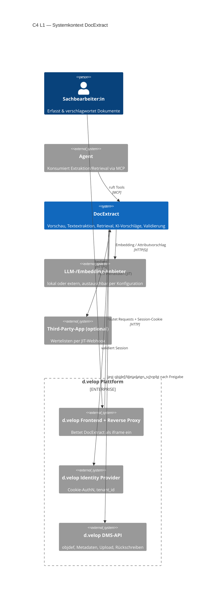
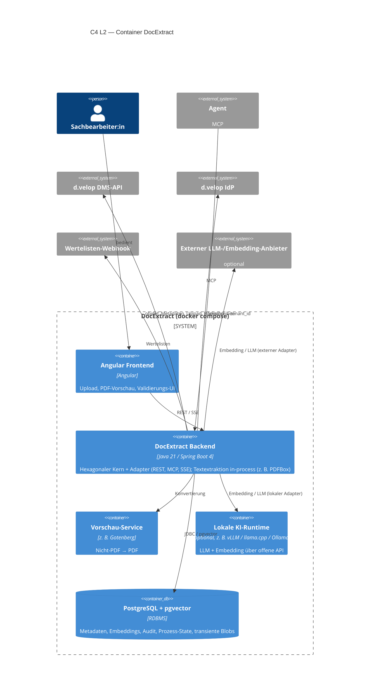
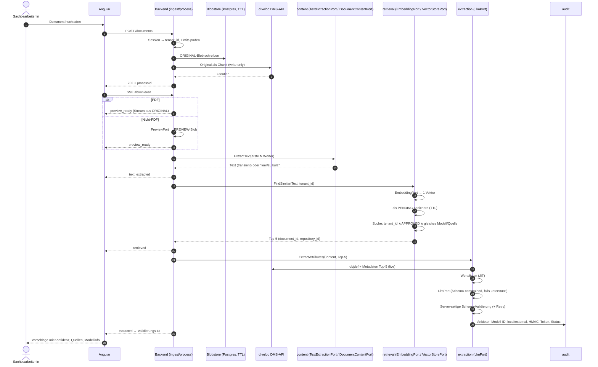
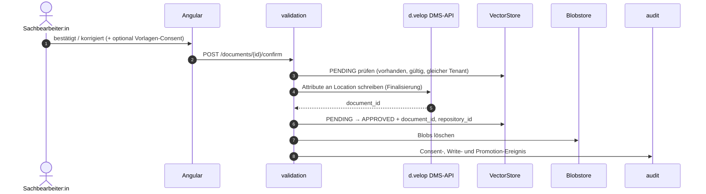
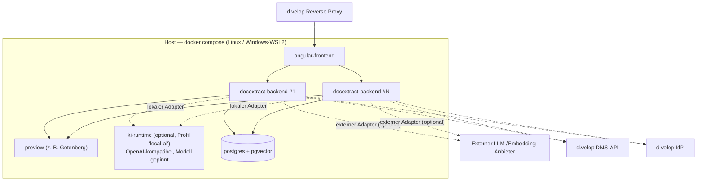
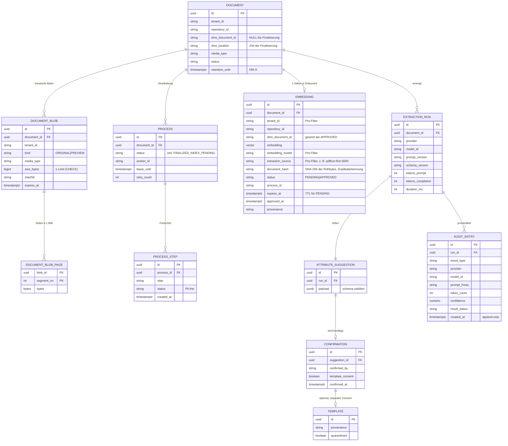

# ARCHITECTURE — DocExtract

**KI-gestützte Dokumenterfassung & -verschlagwortung für d.velop documents**
Architektur-Dokument · Gliederung nach **arc42** · Diagramme in **C4 (Mermaid)**
Bezug: [SPEC.md](SPEC.md) · Blockplanung: [PROJEKTPLAN.md](PROJEKTPLAN.md) · Entscheidungen: § 9 (ADRs)
**Stand:** 09/2026 · **Status:** lebendes Dokument, versioniert pro Block

---

## 0. Traceability zum Bewertungsraster

| Rasterkriterium                                            | Erwartung                           | Abschnitt            |
| ---------------------------------------------------------- | ----------------------------------- | -------------------- |
| **Entwurf (4)** Lösungsansatz bildlich + textuell          | C4-Sichten + Prosa                  | § 3, § 5, § 7        |
| **Entwurf (5)** Struktur · Verhalten · Interaktion         | alle drei Perspektiven              | § 5 · § 6 · § 3      |
| **Entwurf (6)** Datenmodell                                | ER-Modell                           | § 8.4                |
| **Programmierung (7)** Schichten/Module                    | Hexagonal + Modulschnitt            | § 4, § 5.4, § 5.5    |
| **Programmierung (8)** Framework-Konzepte                  | DI, REST, Config, Fehler            | § 5.3, § 8.1         |
| **Validierung (12)** Test-/Sicherheitsstrategie            | Teststufen + Threat-Mitigation      | § 10                 |
| **KI & Architektur (16)** abgesicherte KI-Funktion         | Retrieval + Extraktion + Guardrails | § 6.1, § 8.5, § 10.3 |
| **KI & Architektur (17)** Modulgrenzen, containerlauffähig | Modularer Monolith, Compose         | § 4, § 5, § 7        |
| **KI & Architektur (18)** Reflexion/Veto                   | bewusst nicht delegierte Entscheide | § 9, § 11            |

---

## 1. Einführung und Ziele

DocExtract liest eingehende Dokumente, schlägt Kategorie und Eigenschaftswerte vor und legt sie **nach menschlicher Freigabe** im DMS (d.velop documents) ab. Fachliche Vision, Stakeholder und Anforderungen stehen in [SPEC.md § 1–5](SPEC.md); dieses Dokument beschreibt, **wie** die Lösung aufgebaut ist.

### 1.1 Wichtigste Qualitätsziele (Details SPEC § 3)

| Prio | Qualitätsziel                                 | Architektonischer Treiber                                                        |
| ---- | --------------------------------------------- | -------------------------------------------------------------------------------- |
| 1    | **Extraktionsgüte** (NfA-1)                   | Retrieval-gestützter Prompt, Schema-Validierung, „unbekannt" statt Halluzination |
| 2    | **Mandanten-Isolation** (NfA-4)               | `tenant_id` als Pre-Filter in jeder Vektor-Query                                 |
| 3    | **Austauschbarkeit** (NfA-8)                  | Produktneutraler Kern, Adapterwahl per Konfiguration, Contract-Tests je Port     |
| 4    | **Zuverlässigkeit** (NfA-3)                   | Timeouts je Stufe/Adapter, definierte Fehlerzustände, Lease-Recovery             |
| 5    | **Effizienz** (NfA-2)                         | Ein Embedding je Dokument, kein Chunking, In-Process-Pipeline                    |
| 6    | **Nachvollziehbarkeit & Kosten** (C-4, NfA-7) | Append-only Audit mit Anbieter, Modell-ID, Token-Verbrauch                       |

### 1.2 Architekturprinzipien

1. **Ports & Adapter überall:** Der Kern kennt nur Schnittstellen und ein neutrales Datenformat. Gotenberg, PDFBox, Tika, Docling, LLM-Runtimes oder pgvector sind **austauschbare Referenzadapter** (C-8).
2. **Konfiguration statt Code:** Adapterwechsel, egal ob lokal oder extern, erfolgt ausschliesslich per Konfiguration.
3. **Mensch entscheidet:** Kein DMS-Write, keine Korpus-Aufnahme, keine Vorlage ohne explizite Freigabe (C-2).
4. **Datenminimierung:** Extrahierter Text wird nie persistiert; Embeddings bleiben bis zur Freigabe in Quarantäne (C-7).

---

## 2. Randbedingungen

| Typ         | Randbedingung                                                                                                   | Quelle           |
| ----------- | --------------------------------------------------------------------------------------------------------------- | ---------------- |
| Technisch   | Java 21 · Spring Boot 4 · Angular (iframe) · Spring AI · PostgreSQL · Docker Compose (Empfehlung, kein Zwang)   | SPEC § 4         |
| Integration | App als **iframe hinter d.velop Reverse Proxy**; AuthN über d.velop-Session-Cookie; `tenant_id` aus der Session | SPEC § 4         |
| Betrieb     | `docker compose up` auf Linux und Windows/WSL2; mehrere Backend-Instanzen mit gemeinsamer DB                    | SPEC C-6         |
| Fachlich    | Harte, konfigurierbare Limits (Default: 50 MB, Seitenzahl, Timeouts je Stufe)                                   | SPEC FR-1, T-4   |
| Sicherheit  | Least Privilege, Modell-Pinning, append-only Audit                                                              | SPEC C-3/C-4/C-5 |
| Prozess     | Versioniertes Architektur-Dokument, ADRs für Grundentscheide                                                    | Projektarbeit    |

---

## 3. Kontextabgrenzung — C4 Level 1 (Interaktion)

Die Sachbearbeiter:in nutzt DocExtract im **d.velop-Frontend** (iframe); der Reverse Proxy routet auf den HTTP-Endpunkt. Ein **Agent** nutzt denselben Kern über ein **MCP-Tool** mit identischen Guardrails. LLM und Embedding werden über offene Schnittstellen angebunden. Sie laufen entweder auf einer **lokalen Runtime** oder bei einem **vom Kunden konfigurierten externen Anbieter**.


```mermaid
C4Context
    title C4 L1 — Systemkontext DocExtract
    UpdateLayoutConfig($c4ShapeInRow="3", $c4BoundaryInRow="1")

    Person(sb, "Sachbearbeiter:in", "Erfasst & verschlagwortet Dokumente")
    System_Ext(agent, "Agent", "Konsumiert Extraktion/Retrieval via MCP")

    Enterprise_Boundary(dv, "d.velop Plattform") {
        System_Ext(dvfe, "d.velop Frontend + Reverse Proxy", "Bettet DocExtract als iframe ein")
        System_Ext(idp, "d.velop Identity Provider", "Cookie-AuthN, tenant_id")
        System_Ext(dms, "d.velop DMS-API", "objdef, Metadaten, Upload, Rückschreiben")
    }

    System(docx, "DocExtract", "Vorschau, Textextraktion, Retrieval, KI-Vorschläge, Validierung")

    System_Ext(ai, "LLM-/Embedding-Anbieter", "lokal oder extern, austauschbar per Konfiguration")
    System_Ext(tpa, "Third-Party-App (optional)", "Wertelisten per JIT-Webhook")

    Rel(sb, dvfe, "bedient", "HTTPS")
    Rel(dvfe, docx, "routet Requests + Session-Cookie", "HTTP")
    Rel(agent, docx, "ruft Tools", "MCP")
    Rel(docx, idp, "validiert Session")
    Rel(docx, dms, "liest objdef/Metadaten, schreibt nach Freigabe")
    Rel(docx, ai, "Embedding / Attributvorschlag", "HTTP(S)")
    Rel(docx, tpa, "holt Wertelisten (JIT)")
```

### 3.1 Externe Schnittstellen

| Nachbarsystem           | Richtung | Protokoll                            | Zweck                                                                                                                                                                                     | Hinweis                                 |
| ----------------------- | -------- | ------------------------------------ | ----------------------------------------------------------------------------------------------------------------------------------------------------------------------------------------- | --------------------------------------- |
| d.velop Frontend/Proxy  | in       | HTTP (iframe, REST)                  | UI + API                                                                                                                                                                                  | Session-Cookie durchgereicht            |
| d.velop Frontend/Proxy  | out      | SSE `GET /processes/{id}/events`     | Fortschritt: `preview_ready`, `text_extracted`, `retrieved`, `extracted`, `failed`                                                                                                        | Nur Metadaten, keine PII                |
| d.velop IdP             | out      | HTTP                                 | Session → `tenant_id`                                                                                                                                                                     | Basis für NfA-4                         |
| d.velop DMS-API         | in/out   | HTTP                                 | Lesen: `/r/{repositoryId}/objdef`, `/dms/r/{repositoryId}/o2/{document_id}/` (live, kein Cache). Schreiben: Chunk-Upload → `Location`, Finalisierung mit Attributen **nur nach Freigabe** | Chunk-Upload ist write-only (→ ADR-008) |
| LLM-/Embedding-Anbieter | out      | HTTP(S), z. B. OpenAI-kompatible API | Embedding, Attributvorschlag                                                                                                                                                              | lokal oder extern per Konfiguration     |
| Third-Party-App         | out      | Webhook (JIT)                        | Wertelisten                                                                                                                                                                               | Client-only, kein Import                |
| Agent                   | in       | MCP                                  | Extraktion/Retrieval                                                                                                                                                                      | Minimale Scopes, Consent (T-6)          |

---

## 4. Lösungsstrategie

| Qualitätsziel                 | Lösungsansatz                                                                                                                               | Muster                     |
| ----------------------------- | ------------------------------------------------------------------------------------------------------------------------------------------- | -------------------------- |
| Wartbarkeit, Austauschbarkeit | **Modularer Monolith** mit **Hexagonaler Architektur**; jeder externe Baustein hinter einem Port                                            | Ports & Adapters           |
| Offenheit für beliebige LLMs  | LLM-/Embedding-Port mit **Capability-Modell** (Structured Output, Eingabeform); Referenzprotokoll OpenAI-kompatibel, weitere über Spring AI | Adapter + Capabilities     |
| Mandanten-Isolation           | `tenant_id` als **Pre-Filter** in der Vektor-Query                                                                                          | Security-in-depth          |
| Effizienz, Einfachheit        | **Ein Embedding je Dokument** aus den ersten _N_ Wörtern, kein Chunking                                                                     | Minimal Pipeline           |
| Cluster-Betrieb               | Gemeinsame Datenhaltung in PostgreSQL; laufende Jobs transient instanzgebunden                                                              | Shared-Data, Stateless-App |
| Agent-Konsum                  | REST- und MCP-Adapter teilen dieselben Application-Services                                                                                 | Adapter-Symmetrie          |
| Fortschritts-Feedback         | 202 + `processId`, SSE, Fan-out über Postgres LISTEN/NOTIFY                                                                                 | Event-Push ohne Broker     |
| Korpus-Integrität             | Embeddings als `PENDING` mit TTL, Aktivierung erst nach Freigabe                                                                            | Quarantine-by-Default      |

**Skalierungsmodell:** Die Modultrennung ist **logisch** (Ports, ArchUnit), nicht verteilt. Ein Dokument-Job läuft Ende-zu-Ende auf einer Instanz (In-Process-Aufrufe); verschiedene Dokumente laufen parallel auf verschiedenen Instanzen. Geteilt werden nur Fortschritt, Korpus und transiente Bytes.

---

## 5. Bausteinsicht — C4 Level 2 (Struktur)

### 5.1 Container-Diagramm


```mermaid
C4Container
    title C4 L2 — Container DocExtract
    UpdateLayoutConfig($c4ShapeInRow="3", $c4BoundaryInRow="1")

    Person(sb, "Sachbearbeiter:in")
    System_Ext(agent, "Agent", "MCP")
    System_Ext(dms, "d.velop DMS-API")
    System_Ext(idp, "d.velop IdP")
    System_Ext(tpa, "Wertelisten-Webhook")
    System_Ext(extai, "Externer LLM-/Embedding-Anbieter", "optional")

    System_Boundary(sys, "DocExtract (docker compose)") {
        Container(ng, "Angular Frontend", "Angular", "Upload, PDF-Vorschau, Validierungs-UI")
        Container(app, "DocExtract Backend", "Java 21 / Spring Boot 4", "Hexagonaler Kern + Adapter (REST, MCP, SSE); Textextraktion in-process (z. B. PDFBox)")
        Container(prev, "Vorschau-Service", "z. B. Gotenberg", "Nicht-PDF → PDF")
        Container(rt, "Lokale KI-Runtime", "optional, z. B. vLLM / llama.cpp / Ollama", "LLM + Embedding über offene API")
        ContainerDb(pg, "PostgreSQL + pgvector", "RDBMS", "Metadaten, Embeddings, Audit, Prozess-State, transiente Blobs")
    }

    Rel(sb, ng, "bedient")
    Rel(ng, app, "REST / SSE")
    Rel(agent, app, "MCP")
    Rel(app, prev, "Konvertierung")
    Rel(app, rt, "Embedding / LLM (lokaler Adapter)")
    Rel(app, extai, "Embedding / LLM (externer Adapter)")
    Rel(app, pg, "JDBC / pgvector")
    Rel(app, idp, "Session → tenant_id")
    Rel(app, dms, "objdef, Metadaten, Upload, Rückschreiben")
    Rel(app, tpa, "Wertelisten")
```

### 5.2 Ports & Adapter

Der Kern hängt ausschliesslich von diesen Ports ab. Jeder Adapter muss die **Contract-Test-Suite** seines Ports bestehen (NfA-8, C-8).

| Port                              | Vertrag (Mindestanforderung)                                                                                                 | Referenzadapter                             | Mögliche Alternativen                                                         |
| --------------------------------- | ---------------------------------------------------------------------------------------------------------------------------- | ------------------------------------------- | ----------------------------------------------------------------------------- |
| **PreviewPort**                   | Dokument → PDF-Vorschau; Limits & Timeout einhaltbar                                                                         | Gotenberg                                   | JODConverter/LibreOffice headless, Aspose, …                                  |
| **TextExtractionPort** (nur FR-3) | Dokument → Klartext der ersten _N_ Wörter; leerer/zu kurzer Text wird gemeldet                                               | Apache PDFBox (in-process)                  | Apache Tika (Library/Server), Docling                                         |
| **DocumentContentPort** (FR-4)    | Dokument → konfigurierte Repräsentation (`FULLTEXT`, `MARKDOWN`, `PAGE_IMAGES`) passend zu den Capabilities des LLM-Adapters | Volltext via PDFBox                         | Markdown via Docling, Seitenbilder via PDFBox-Rendering                       |
| **LlmPort**                       | Prompt + JSON-Schema (+ Repräsentation) → Antwort; liefert Anbieter, Modell-ID, Token-Verbrauch; deklariert Capabilities     | OpenAI-kompatibler Adapter (lokale Runtime) | beliebige OpenAI-kompatible Runtime oder Anbieter, weitere Spring-AI-Provider |
| **EmbeddingPort**                 | Text → Vektor + Embedding-Modell-ID + Dimension                                                                              | OpenAI-kompatibler Adapter (lokale Runtime) | wie LlmPort                                                                   |
| **VectorSearchPort**              | Nur lesend: Ähnlichkeitssuche mit **Pre-Filter** (`tenant_id`, `status`, `embedding_model`, `extraction_source`)             | pgvector                                    | Qdrant, OpenSearch (sofern Pre-Filter garantiert)                             |

**Weitere, interne Outbound-Ports** (nicht produktgebunden), bewusst schmal statt eines einzelnen breiten Ports (C-3 Least Privilege): `PendingEmbeddingPort` (retrieval: `PENDING` stagen), `CorpusPromotionPort` (validation: `PENDING → APPROVED` promoten — einzige Schreibberechtigung auf `status`), `PendingEmbeddingDeletePort` (validation/Cleanup: Ablehnung/TTL löschen), `DmsObjectDefinitionPort` (`GET .../objdef`), `DmsObjectMetadataPort` (`GET .../o2/{document_id}/`), `DmsWritePort`, `DmsChunkUploadPort`, `ValueListPort`, `DocumentBlobPort`, `ProcessStatePort`, `AuditLogPort`, `AuthContextPort`.

**Neutrales Datenformat im Kern (Auszug):** `DocumentRef`, `ExtractedText`, `DocumentContent`, `EmbeddingVector(modelId, dim, values)`, `ExtractionRequest`, `ExtractionResponse`, `ExtractedAttribute(propertyId, value, values, confidence, sourceExcerpt)`, `ModelInfo(provider, modelId)`, `LlmCapabilities(structuredOutput: NATIVE|NONE, inputs: TEXT|IMAGES)`.

### 5.3 Adapterwahl per Konfiguration

Adapter werden über `@ConditionalOnProperty` aktiviert; es ist immer genau ein Adapter je Port geladen. Ein Wechsel erfordert keinen Code im Kern.

```yaml
docextract:
  adapters:
    preview: gotenberg # gotenberg | jodconverter | …
    text-extraction: pdfbox # pdfbox | tika | docling
    document-content: fulltext # fulltext | markdown | page-images
    vector-store: pgvector # wählt den Adapter für VectorSearchPort/PendingEmbeddingPort/CorpusPromotionPort/PendingEmbeddingDeletePort
    llm:
      type: openai-compatible # openai-compatible | <spring-ai-provider>
      base-url: ${LLM_BASE_URL} # lokale Runtime oder externer Endpunkt
      model-id: ${LLM_MODEL_ID} # explizit versioniert, kein "latest" (C-5)
      api-key: ${LLM_API_KEY:}
      api-version: # optional, Microsoft-Foundry/Azure-OpenAI api-version
      timeout: 60s
      max-retries: 1
    embedding:
      type: openai-compatible
      base-url: ${EMBEDDING_BASE_URL}
      model-id: ${EMBEDDING_MODEL_ID}
  text-extraction:
    max-words: 5000 # ≤ Kontextfenster des Embedding-Modells
  limits:
    max-file-size: 50MB
    max-pages: 200
    stage-timeout: 30s
```

**Regeln:** Secrets nur über Umgebungsvariablen. Beim Start wird geprüft, ob `max-words` in das Kontextfenster des Embedding-Modells passt und ob die gewählte `document-content`-Repräsentation zu den Capabilities des LLM-Adapters passt. Ein Wechsel des Embedding-Modells löst eine Re-Indexierung aus (§ 8.5).

### 5.4 Fachmodule

| Modul            | Verantwortung                                                                                            | Inbound-Port                      | Wichtigste Outbound-Ports                               |
| ---------------- | -------------------------------------------------------------------------------------------------------- | --------------------------------- | ------------------------------------------------------- |
| **ingest**       | Upload, Limits, Ablage der Roh-Bytes, DMS-Chunk-Upload, Vorschau-Streaming (FR-1)                        | `IngestDocument`, `StreamPreview` | `DocumentBlobPort`, `PreviewPort`, `DmsChunkUploadPort` |
| **content**      | Textextraktion der ersten _N_ Wörter (FR-2) und Dokumentrepräsentation für FR-4; nichts wird persistiert | `ExtractText`, `ProvideContent`   | `TextExtractionPort`, `DocumentContentPort`             |
| **retrieval**    | Ein Embedding je Dokument, Staging als `PENDING`, Top-5-Suche mit Pre-Filter (FR-3)                      | `FindSimilar`                     | `EmbeddingPort`, `VectorStorePort`, `AuthContextPort`   |
| **extraction**   | KI-Attributvorschläge mit objdef, Top-5-Metadaten, Wertelisten; Schema-Validierung, Retry (FR-4)         | `ExtractAttributes`               | `LlmPort`, `DmsReadPort`, `ValueListPort`               |
| **validation**   | Freigabe, DMS-Rückschreiben, Promotion `PENDING → APPROVED`, separater Vorlagen-Consent (FR-5)           | `Confirm`, `Reject`               | `DmsWritePort`, `VectorStorePort`                       |
| **agentgateway** | MCP-Tool, nutzt dieselben Application-Services (FR-6)                                                    | `McpTool`                         | wie UI-Pfad                                             |
| **process**      | Async-Orchestrierung, SSE, Lease/Heartbeat, Recovery                                                     | `SubscribeProgress`               | `ProcessStatePort`                                      |
| **audit**        | Append-only Protokoll, Token/Kosten (C-4, NfA-7)                                                         | —                                 | `AuditLogPort`                                          |
| **security**     | Session → `tenant_id`, Consent-Gate                                                                      | `AuthContextPort`                 | —                                                       |

### 5.5 Paketstruktur

```
ch.adeon.apps.docextract
├─ ingest
│  ├─ domain        # DocumentUpload, Limits, BlobRef, DmsLocation
│  ├─ application   # IngestDocumentService, PreviewStreamService
│  ├─ port          # PreviewPort, DocumentBlobPort, DmsChunkUploadPort
│  └─ adapter
│     ├─ in.rest    # UploadController (202 + processId), PreviewController (Range)
│     ├─ out.preview # GotenbergPreviewAdapter (Paketname folgt dem Port, nicht dem Produkt)
│     ├─ out.blob   # PgDocumentBlobAdapter
│     └─ out.dms
├─ content
│  ├─ domain        # ExtractedText, DocumentContent, Representation
│  ├─ application   # ExtractTextService (erste N Wörter), ContentService
│  ├─ port          # TextExtractionPort, DocumentContentPort
│  └─ adapter.out   # pdfbox | tika | docling
├─ retrieval
│  ├─ domain        # SimilarityQuery, TenantFilter, EmbeddingSpec, DmsDocumentMetadata
│  ├─ application   # FindSimilarService, StagePendingService, ReindexService
│  ├─ port          # EmbeddingPort, VectorSearchPort, PendingEmbeddingPort, DmsObjectDefinitionPort, DmsObjectMetadataPort, ValueListPort
│  └─ adapter.out   # openai-compatible | springai.* | pgvector | dms (DmsObjectDefinitionAdapter, DmsObjectMetadataAdapter)
├─ extraction
│  ├─ domain        # AttributeSchema, ExtractionResult, Confidence, ModelInfo, ExtractedAttribute(sourceExcerpt)
│  ├─ application   # ExtractAttributesService (Schema-Validierung, Retry)
│  ├─ port          # LlmPort
│  └─ adapter.out   # openai-compatible | springai.*
├─ validation
│  ├─ domain        # ConfirmationCommand, ConfirmationResult
│  ├─ application   # ConfirmAndWriteBackService (Consent-Gate, Saga), RejectService
│  ├─ port          # DmsWritePort, CorpusPromotionPort, PendingEmbeddingDeletePort
│  └─ adapter.out   # dms | postgres
├─ agentgateway     # adapter.in.mcp
├─ process          # Orchestrator, SSE, PgNotify, StaleJobRecovery
├─ audit            # append-only, ohne Roh-PII
├─ security         # AuthContext, TenantResolver, ConsentGuard
└─ shared           # Fehler, Config, Observability, TtlCleanupJob
```

**Verantwortlichkeitsprinzip:** `domain`, `application` und `port` enthalten **keine Produkt- oder Framework-Typen**. Produktspezifischer Code liegt ausschliesslich in `adapter.*`. Security und Audit werden per DI/Aspekten eingezogen, damit REST und MCP dieselben Guardrails durchlaufen. Erzwungen per ArchUnit (§ 10.1).

---

## 6. Laufzeitsicht (Verhalten & Interaktion)

### 6.1 Happy Path: Upload bis Vorschläge

Der Request wird mit `202 + processId` beantwortet, sobald die Roh-Bytes im Blobstore liegen und das Original als Chunk ins DMS geladen ist. Danach läuft die Pipeline asynchron auf einer Instanz.


```mermaid
sequenceDiagram
    autonumber
    actor SB as Sachbearbeiter:in
    participant FE as Angular
    participant API as Backend (ingest/process)
    participant BLB as Blobstore (Postgres, TTL)
    participant DMS as d.velop DMS-API
    participant CNT as content (TextExtractionPort / DocumentContentPort)
    participant RET as retrieval (EmbeddingPort / VectorStorePort)
    participant EXT as extraction (LlmPort)
    participant AUD as audit

    SB->>FE: Dokument hochladen
    FE->>API: POST /documents
    API->>API: Session → tenant_id, Limits prüfen
    API->>BLB: ORIGINAL-Blob schreiben
    API->>DMS: Original als Chunk (write-only)
    DMS-->>API: Location
    API-->>FE: 202 + processId
    FE->>API: SSE abonnieren
    alt PDF
        API-->>FE: preview_ready (Stream aus ORIGINAL)
    else Nicht-PDF
        API->>API: PreviewPort → PREVIEW-Blob
        API-->>FE: preview_ready
    end
    API->>CNT: ExtractText(erste N Wörter)
    CNT-->>API: Text (transient) oder "leer/zu kurz"
    API-->>FE: text_extracted
    API->>RET: FindSimilar(Text, tenant_id)
    RET->>RET: EmbeddingPort → 1 Vektor
    RET->>RET: als PENDING speichern (TTL)
    RET->>RET: Suche: tenant_id ∧ APPROVED ∧ gleiches Modell/Quelle
    RET-->>API: Top-5 (document_id, repository_id)
    API-->>FE: retrieved
    API->>EXT: ExtractAttributes(Content, Top-5)
    EXT->>DMS: objdef + Metadaten Top-5 (live)
    EXT->>EXT: Wertelisten (JIT)
    EXT->>EXT: LlmPort (Schema-constrained, falls unterstützt)
    EXT->>EXT: Server-seitige Schema-Validierung (+ Retry)
    EXT->>AUD: Anbieter, Modell-ID, local/external, HMAC, Token, Status
    API-->>FE: extracted → Validierungs-UI
    FE-->>SB: Vorschläge mit Konfidenz, Quellen, Modellinfo
```

### 6.2 Freigabe und Korpus-Promotion (C-2, C-7)


```mermaid
sequenceDiagram
    autonumber
    actor SB as Sachbearbeiter:in
    participant FE as Angular
    participant VAL as validation
    participant DMS as d.velop DMS-API
    participant VDB as VectorStore
    participant BLB as Blobstore
    participant AUD as audit

    SB->>FE: bestätigt / korrigiert (+ optional Vorlagen-Consent)
    FE->>VAL: POST /documents/{id}/confirm
    VAL->>VDB: PENDING prüfen (vorhanden, gültig, gleicher Tenant)
    VAL->>DMS: Attribute an Location schreiben (Finalisierung)
    DMS-->>VAL: document_id
    VAL->>VDB: PENDING → APPROVED + document_id, repository_id
    VAL->>BLB: Blobs löschen
    VAL->>AUD: Consent-, Write- und Promotion-Ereignis
```

**Konsistenz (Saga):** Zuerst DMS-Finalisierung, dann Promotion. Schlägt die Promotion fehl, bleibt der Prozess in `FINALIZED_INDEX_PENDING`; ein idempotenter Retry promotet erneut. Der TTL-Cleanup überspringt diesen Zustand.
**Ablehnung/Abbruch/TTL-Ablauf:** `PENDING`-Embedding und Blobs werden gelöscht.
**Vorlage:** Nur mit separatem, explizitem Consent (FR-5), herkunftsmarkiert.

### 6.3 Agent-Pfad (MCP)

Das MCP-Tool ruft dieselben Services (`FindSimilar`, `ExtractAttributes`) mit minimalen Scopes auf. Ein DMS-Write ist auch hier nur nach expliziter menschlicher Freigabe möglich (C-2, T-6). Alle Tool-Calls werden auditiert.

### 6.4 Fortschritt im Cluster (ADR-004)

Die SSE-Verbindung kann auf einer beliebigen Instanz landen. Jede Stufe schreibt einen PII-freien Eintrag in `PROCESS_STEP` und sendet `NOTIFY`. Die SSE-haltende Instanz hört per `LISTEN` mit und lädt bei einem Reconnect verpasste Schritte aus `PROCESS_STEP` nach.

### 6.5 Fehlerpfade (NfA-3)

| Fehler                                                   | Verhalten                                                                                              | Endzustand                              |
| -------------------------------------------------------- | ------------------------------------------------------------------------------------------------------ | --------------------------------------- |
| Limit überschritten                                      | Abweisung vor Verarbeitung                                                                             | `413`/`422` ProblemDetail               |
| Leerer/zu kurzer Text (z. B. Scan ohne Textlayer)        | Retrieval übersprungen, Hinweis im UI; FR-4 nur, wenn Repräsentation dies erlaubt (z. B. Seitenbilder) | `failed` oder Vorschlag ohne Referenzen |
| Adapter-Absturz/Timeout (Vorschau, Text, LLM, Embedding) | Timeout je Adapter, begrenzter Retry                                                                   | `failed` + Audit                        |
| Ungültiges LLM-JSON                                      | Retry gemäss Konfiguration, dann Abbruch                                                               | `failed` + Audit                        |
| Externer Anbieter nicht erreichbar                       | wie Timeout; kein automatischer Wechsel auf einen anderen Anbieter                                     | `failed` + Audit                        |
| Instanzausfall                                           | Lease läuft ab → Recovery wiederholt aus ORIGINAL-Blob (solange TTL gültig)                            | definiert beendet oder neu gestartet    |

---

## 7. Verteilungssicht


```mermaid
flowchart TB
    proxy["d.velop Reverse Proxy"] --> fe
    subgraph host["Host — docker compose (Linux / Windows-WSL2)"]
      fe["angular-frontend"]
      be1["docextract-backend #1"]
      be2["docextract-backend #N"]
      prev["preview (z. B. Gotenberg)"]
      rt["ki-runtime (optional, Profil 'local-ai')<br/>OpenAI-kompatibel, Modell gepinnt"]
      db[("postgres + pgvector")]
    end
    fe --> be1 & be2
    be1 & be2 --> prev & db
    be1 & be2 -. "lokaler Adapter" .-> rt
    be1 & be2 -. "externer Adapter (optional)" .-> ext["Externer LLM-/Embedding-Anbieter"]
    be1 & be2 -.-> dms["d.velop DMS-API"] & idp["d.velop IdP"]
```

- **Compose-Profile:** `local-ai` startet eine lokale KI-Runtime. Ohne dieses Profil zeigen die Adapter auf einen externen Endpunkt. Ein Profil `ci` nutzt Mocks und Contract-Stubs.
- **Austausch von Diensten:** Der Vorschau-Container (z. B. Gotenberg) und die KI-Runtime sind reine Referenzbelegungen. Ein anderer Dienst wird eingesetzt, indem man Image und Adapter-Property ändert.
- **Cluster:** N Backend-Instanzen, keine Sticky Sessions, gemeinsame DB. Jobs bleiben transient instanzgebunden (Lease + Heartbeat).
- **Reproduzierbar (C-6):** Images per Digest fixiert, lokale Modelle per Digest und externe Modelle per versionierter Modell-ID gepinnt (C-5).
- **Blobstore:** Pro laufendem Prozess höchstens 2 × Upload-Limit (ORIGINAL + PREVIEW). Das Volumen wird durch TTL und Parallelität begrenzt, eigener Tablespace, `STORAGE EXTERNAL`.

---

## 8. Querschnittliche Konzepte

### 8.1 Framework-Konzepte (Spring Boot 4)

- **DI:** Ports als Interfaces, Adapter als bedingte Beans (`@ConditionalOnProperty`). Security und Audit werden per Aspekt eingezogen.
- **REST:** OpenAPI-spezifiziert, Fehler als ProblemDetail (RFC 9457).
- **Konfiguration:** `application.yml` + Profile (`local`, `local-ai`, `ci`, `cluster`), typisierte `@ConfigurationProperties` mit Validierung beim Start.
- **Fehlerbehandlung:** zentraler `@ControllerAdvice`; Timeout und definierter Abbruch je Stufe und Adapter.

### 8.2 Sicherheit & Datenschutz

- **AuthN/AuthZ:** d.velop-Session → `tenant_id` → Pre-Filter im Retrieval (NfA-4). Consent-Gate vor jeder irreversiblen Aktion (C-2).
- **Least Privilege (C-3):** LLM- und Embedding-Adapter erhalten nur Eingabedaten und haben keinen Zugriff auf DB, Vektor-Store oder DMS. Nur der Validierungspfad setzt `APPROVED`. Das MCP-Tool hat minimale Scopes.
- **Prompt Injection (T-1):** Der Dokumentinhalt wird im Prompt klar als _untrusted data_ abgegrenzt. Die Antwort wird immer serverseitig gegen das JSON-Schema validiert. Aus LLM-Ausgaben werden keine Tool-Calls abgeleitet.
- **Datenminimierung (NfA-5):** Extrahierter Text und Dokumentrepräsentation leben nur im Job-Kontext. Persistiert werden ausschliesslich Embeddings (mit TTL bis zur Freigabe), Metadaten und Audit-Hashes. Roh-/Preview-Bytes liegen TTL-begrenzt im Blobstore. Die Löschkaskade umfasst Dokument, Blobs und Embeddings; Audit-Einträge bleiben ohne Roh-PII erhalten.

### 8.3 Observability & Audit

- Strukturiertes Logging mit Latenz je Stufe (NfA-2), Metriken (Micrometer/Prometheus), Traces (OpenTelemetry).
- **Audit je LLM-/Tool-Call (C-4):** Anbieter, Modell-ID, Prompt-/Schema-Version, mandantenspezifischer HMAC des kanonisierten Prompts, Token (Prompt/Completion) bzw. LLM-Sekunden lokal, Konfidenz, Ergebnisstatus. Datenquelle für NfA-7.
- **Betriebsmetriken:** Anzahl/Alter von `PENDING`-Einträgen und Blobs, Adapter-Fehlerraten je Anbieter.

### 8.4 Datenmodell


```mermaid
erDiagram
    DOCUMENT ||--o{ PROCESS : "Verarbeitung"
    DOCUMENT ||--o{ DOCUMENT_BLOB : "transiente Bytes"
    DOCUMENT_BLOB ||--o{ DOCUMENT_BLOB_PAGE : "Seiten à 1 MiB"
    DOCUMENT ||--o| EMBEDDING : "1 Vektor je Dokument"
    PROCESS ||--o{ PROCESS_STEP : "Fortschritt"
    DOCUMENT ||--o{ EXTRACTION_RUN : "erzeugt"
    EXTRACTION_RUN ||--|| ATTRIBUTE_SUGGESTION : "liefert"
    ATTRIBUTE_SUGGESTION ||--o| CONFIRMATION : "wird bestätigt"
    CONFIRMATION ||--o| TEMPLATE : "optional, separater Consent"
    EXTRACTION_RUN ||--o{ AUDIT_ENTRY : "protokolliert"

    DOCUMENT {
        uuid id PK
        string tenant_id
        string repository_id
        string dms_document_id "NULL bis Finalisierung"
        string dms_location "Ziel der Finalisierung"
        string media_type
        string status
        timestamptz retention_until "NfA-5"
    }
    EMBEDDING {
        uuid id PK
        uuid document_id FK
        string tenant_id "Pre-Filter"
        string repository_id
        string dms_document_id "gesetzt bei APPROVED"
        vector embedding
        string embedding_model "Pre-Filter"
        string extraction_source "Pre-Filter, z. B. pdfbox:first-5000"
        string document_hash "SHA-256 der Rohbytes, Duplikaterkennung"
        string status "PENDING|APPROVED"
        string process_id
        timestamptz expires_at "TTL für PENDING"
        timestamptz approved_at
        string provenance
    }
    DOCUMENT_BLOB {
        uuid id PK
        uuid document_id FK
        string tenant_id
        string kind "ORIGINAL|PREVIEW"
        string media_type
        bigint size_bytes "≤ Limit (CHECK)"
        string sha256
        timestamptz expires_at
    }
    DOCUMENT_BLOB_PAGE {
        uuid blob_id PK
        int segment_no PK
        bytea bytes
    }
    PROCESS {
        uuid id PK
        uuid document_id FK
        string status "inkl. FINALIZED_INDEX_PENDING"
        string worker_id
        timestamptz lease_until
        int retry_count
    }
    PROCESS_STEP {
        uuid id PK
        uuid process_id FK
        string step
        string status "PII-frei"
        timestamptz created_at
    }
    EXTRACTION_RUN {
        uuid id PK
        uuid document_id FK
        string provider
        string model_id
        string prompt_version
        string schema_version
        int tokens_prompt
        int tokens_completion
        int duration_ms
    }
    ATTRIBUTE_SUGGESTION {
        uuid id PK
        uuid run_id FK
        jsonb payload "schema-validiert"
    }
    CONFIRMATION {
        uuid id PK
        uuid suggestion_id FK
        string confirmed_by
        boolean template_consent
        timestamptz confirmed_at
    }
    TEMPLATE {
        uuid id PK
        string provenance
        boolean quarantined
    }
    AUDIT_ENTRY {
        uuid id PK
        uuid run_id FK
        string event_type
        string provider
        string model_id
        string prompt_hmac
        int token_count
        numeric confidence
        string result_status
        timestamptz created_at "append-only"
    }
```

**Migrationen:** Flyway. Der pgvector-Index (HNSW) wird mit `tenant_id`, `status` und `embedding_model` als Filterspalten gebaut. Die Vektor-Dimension hängt am Embedding-Modell; ein Modellwechsel erzeugt eine neue Index-Generation und startet die Re-Indexierung. Auf `expires_at` liegt ein Index für den Cleanup.

### 8.5 KI-Integration

Zwei getrennte Modellnutzungen, je über einen eigenen Port und unabhängig konfigurierbar:

- **Retrieval (FR-2/FR-3):** Der TextExtractionPort liefert die ersten _N_ Wörter (Default 5 000). Der EmbeddingPort erzeugt daraus **einen Vektor je Dokument**, der als `PENDING` gespeichert wird. Die Suche liefert die Top-5 mit Pre-Filter auf `tenant_id`, `status = APPROVED` sowie dasselbe `embedding_model` und dieselbe `extraction_source`, damit nur vergleichbare Vektoren verglichen werden. Die Kennzahl ist Precision@3 (NfA-6).
- **Duplikaterkennung:** Der SHA-256-Hash der rohen Upload-Bytes (`document_hash`) wird pro Prozess transient gehalten und bei jedem Embedding-Schritt mitgespeichert. Findet sich für denselben `tenant_id`/`embedding_model`/`extraction_source` bereits ein `APPROVED`-Eintrag mit identischem Hash, wird dessen Vektor wiederverwendet statt den EmbeddingPort erneut aufzurufen — spart Kosten/Latenz bei Mehrfach-Uploads desselben Dokuments (NfA-2/-7).
- **Extraktion (FR-4):** Der LlmPort erhält (a) die konfigurierte Dokumentrepräsentation, (b) Kategorien und Eigenschaften aus objdef, (c) Kategorie und Werte der Top-5 live aus dem DMS sowie (d) Wertelisten. Unterstützt der Adapter Structured Output (`NATIVE`), wird schema-constrained Decoding genutzt. Die serverseitige Validierung erfolgt **immer**. Kann kein zulässiger Wert bestimmt werden, wird „unbekannt" zurückgegeben (E-5).
- **Offenheit für offene LLMs:** Referenzprotokoll ist die verbreitete OpenAI-kompatible API. Damit sind lokale Runtimes mit offenen Modellen und gehostete Anbieter ohne neuen Code nutzbar. Anbieter ohne diese API werden über Spring-AI-Provider oder einen eigenen Adapter angebunden (ADR-009, ADR-011).
- **Modellwechsel (C-5):** Nur per auditierter Konfigurationsänderung und mit Regressionslauf gegen das Eval-Set. Beim Embedding-Modell kommt eine Re-Indexierung hinzu.

---

## 9. Architekturentscheidungen (ADRs)

ADR-001 bis ADR-003 wurden **bewusst nicht an die KI delegiert** (Krit. 18). Archiviert: ADR-005 (abgelöst durch ADR-008), ADR-007 (docling-Chunking, abgelöst durch ADR-012), ADR-010 (anbieterspezifischer Opt-in, aufgegangen in ADR-011).

### ADR-001 — Modularer Monolith statt Microservices

- **Status:** akzeptiert
- **Entscheidung:** Ein deploybarer Monolith mit hexagonalen Fachmodulen; Cluster über gemeinsame Datenhaltung.
- **Begründung:** Keine NfA rechtfertigt Verteilungskosten. In-Process-Aufrufe halten die Latenz tief (NfA-2).
- **Konsequenz:** Modulgrenzen werden per ArchUnit hart gehalten, damit ein späterer Split möglich bleibt.

### ADR-002 — Mandanten-Pre-Filter im Retrieval

- **Status:** akzeptiert
- **Entscheidung:** `tenant_id` aus der Session ist Prädikat der Vektor-Query, kein Post-Filter.
- **Begründung:** Garantiert 0 Fremdtreffer und ist testbar (NfA-4, T-3).
- **Konsequenz:** Jeder VectorStore-Adapter muss den Pre-Filter im Contract-Test nachweisen.

### ADR-003 — Human-in-the-Loop mit hartem Consent-Gate (auch MCP)

- **Status:** akzeptiert
- **Entscheidung:** Keine LLM-Ausgabe löst selbsttätig einen Write oder Tool-Call aus. DMS-Write, Promotion und Vorlagen-Aufnahme erfolgen nur nach expliziter Freigabe, in UI und MCP gleich.
- **Konsequenz:** `DmsWritePort` ist der einzige Schreibpfad. Der initiale Chunk-Upload ohne Attribute gilt nicht als irreversibler Write.

### ADR-004 — Asynchrone Pipeline mit SSE über Postgres LISTEN/NOTIFY

- **Status:** akzeptiert
- **Entscheidung:** 202 + `processId`, SSE je Prozess, Fan-out via LISTEN/NOTIFY, durable `PROCESS_STEP` für Catch-up.
- **Begründung:** Kein zusätzlicher Broker nötig; Postgres ist bereits gemeinsame Basis.
- **Konsequenz:** Payload nur `processId`/`step`; Heartbeat gegen Proxy-Timeouts.

### ADR-006 — Text flüchtig, Embeddings in Quarantäne

- **Status:** akzeptiert (aktualisiert: Chunks entfallen)
- **Entscheidung:** Extrahierter Text und Dokumentrepräsentation bleiben im Job-Kontext. Das Embedding wird als `PENDING` mit TTL gespeichert und nach Freigabe ohne Neuberechnung promotet, sonst gelöscht.
- **Begründung:** Keine doppelte Vektorisierung, kein Rohtext at-rest, ungeprüfte Dokumente beeinflussen den Korpus nicht (T-2).
- **Konsequenz:** TTL-Cleanup, Schutz von `FINALIZED_INDEX_PENDING`, Tests gegen `PENDING`-Treffer.

### ADR-008 — Transienter Postgres-Blobstore (gechunktes BYTEA)

- **Status:** akzeptiert
- **Kontext:** Der DMS-Chunk-Upload ist write-only; ein gemeinsamer Object Store ist nicht vorhanden.
- **Entscheidung:** `DOCUMENT_BLOB` + `DOCUMENT_BLOB_PAGE` (1-MiB-Seiten) als cluster-sichtbare Quelle für Job und Range-fähige Vorschau.
- **Begründung:** Range-Zugriff ohne Heap-Materialisierung; derselbe TTL-Cleanup wie für Embeddings. Large Objects hätten eine zweite Aufräumsemantik gebracht.
- **Offene Grenze:** Bei deutlich höheren Limits oder hoher Parallelität wird ein Object Store hinter dem `DocumentBlobPort` eingesetzt.

### ADR-009 — Spring AI als technische KI-Integrationsschicht

- **Status:** akzeptiert (aktualisiert: anbieterneutral)
- **Entscheidung:** Spring AI wird **innerhalb der Adapter** für Chat, Embedding, Structured Output und MCP genutzt. Spring-AI-Typen verlassen die Adapter nie.
- **Begründung:** Breite Provider-Abdeckung ohne eigene Integrationen; passt zum Spring-Stack.
- **Abgrenzung:** Retrieval-Filter, Quarantäne, Consent, Audit und Prompt-/Schema-Versionierung bleiben in DocExtract. Der generische Spring-AI-`VectorStore` wird nicht verwendet, wenn er die Pre-Filter verdecken würde.
- **Ausnahme:** Reicht Spring AI für eine Funktion nicht aus, darf ein Adapter die Anbieter-API direkt nutzen, gekapselt hinter demselben Port.

### ADR-011 — Offener, produktneutraler Adapter-Ansatz für alle externen Bausteine

- **Status:** akzeptiert
- **Kontext:** SPEC C-8/NfA-8: Vorschau, Textextraktion, LLM, Embedding und Vektor-Store müssen per Konfiguration austauschbar sein. Die frühere Festlegung auf eine bestimmte lokale LLM-Runtime schränkte die Wahl offener Modelle und Anbieter ein.
- **Entscheidung:** Jeder externe Baustein liegt hinter einem Port mit Contract-Test-Suite. Adapter werden per Property gewählt. Für LLM und Embedding ist ein **generischer OpenAI-kompatibler Adapter** die Referenz; er deckt lokale Runtimes mit offenen Modellen ebenso ab wie gehostete Anbieter. Ein Capability-Modell (Structured Output, Eingabeform) macht Unterschiede zwischen Modellen explizit.
- **Begründung:** Kein Vendor-Lock-in; neue Modelle oder Runtimes brauchen in der Regel nur Konfiguration. Der Kern bleibt stabil.
- **Konsequenz:** Contract-Tests in CI für alle Ports; LLM-Port mit mindestens zwei grünen Adaptern (1 lokal, 1 extern). Eval-Läufe und NfA-Werte werden je Adapter ausgewiesen. ArchUnit-Regel: keine Produkttypen im Kern.

### ADR-012 — Ein Embedding je Dokument aus den ersten _N_ Wörtern (statt Chunking)

- **Status:** akzeptiert (ersetzt ADR-007)
- **Kontext:** FR-3 braucht eine Ähnlichkeit auf Dokumentebene („ähnliche frühere Fälle"), keine Passage-Suche.
- **Entscheidung:** Der TextExtractionPort liefert den Klartext der ersten _N_ Wörter (Default 5 000, ≤ Kontextfenster des Embedding-Modells). Daraus entsteht genau ein Vektor. Es gibt keine Struktur- oder Tabellenrekonstruktion.
- **Begründung:** Einfacher, schneller (NfA-2), jeder Textextraktor ist als Adapter einsetzbar. Die FR-4-Qualität hängt nicht daran, weil FR-4 eine eigene Repräsentation nutzt.
- **Konsequenz:** `extraction_source` und `embedding_model` werden als Filter geführt. Genügt Precision@3 nicht (NfA-6), sind _N_ und das Embedding-Modell die ersten Stellhebel.
- **Re-Indexierung (Implementierungsstand):** Da Rohtext nie persistiert wird (ADR-006), kann `ReindexService` bestehende Dokumente nicht automatisch neu vektorisieren. Beim Start vergleicht er `docextract.retrieval.embedding-model` mit den in der Datenbank vorhandenen `embedding_model`-Werten und markiert `APPROVED`-Zeilen eines abgelösten Modells als `STALE` — dieser Status ist vom Retrieval-Prädikat `status = 'APPROVED'` bereits ausgeschlossen, ohne Codeänderung an der Suche. Betroffene Dokumente müssen erneut hochgeladen werden, um wieder im Korpus zu erscheinen; das ist eine Betriebs-Kennzahl (Anzahl `STALE`-Zeilen), kein automatischer Re-Ingest.

---

## 10. Test-, Sicherheits- und Betriebsstrategie

### 10.1 Teststrategie

| Stufe           | Umfang                                                                                                                              | Bezug           |
| --------------- | ----------------------------------------------------------------------------------------------------------------------------------- | --------------- |
| Unit            | Limits, Wortbegrenzung, Schema-Validierung, Tenant-Filter, Retry-Regel                                                              | FR-1/-2/-4      |
| **Contract**    | Abstrakte Test-Suite je Port; jeder Adapter (z. B. PDFBox, Tika, Docling, Gotenberg, OpenAI-kompatibel, pgvector) muss sie bestehen | NfA-8, C-8      |
| Integration     | Adapter gegen echte Container (Testcontainers), DMS/Webhook als Stub                                                                | § 5.2           |
| Architektur     | ArchUnit: keine Produkt-/Framework-Typen in `domain`/`application`/`port`; Modulgrenzen                                             | NfA-8, Krit. 17 |
| Fehlerinjektion | ungültiges LLM-JSON, Adapter-Absturz, leerer Text, OCR-Müll, Timeout/Ausfall externer Anbieter                                      | NfA-3           |
| Cross-Tenant    | automatisiert, 0 Fremdtreffer; Blob-Zugriff nur mit passender `tenant_id`                                                           | NfA-4           |
| Quarantäne      | `PENDING` nie im Retrieval; Promotion ohne Neuberechnung; Cleanup                                                                   | C-7, T-2        |
| Löschung        | Löschkaskade, Prüfung auf Rest-PII                                                                                                  | NfA-5           |
| Async/SSE       | Reihenfolge, Reconnect-Catch-up, Lease-Recovery                                                                                     | ADR-004         |
| Eval (KI)       | Soll/Ist-JSON und Precision@3 **je LLM-/Embedding-Adapter**; ≥ 100 Läufe für p95/Kosten                                             | NfA-1/-2/-6/-7  |
| Egress          | Mit rein lokaler Konfiguration keine externen Verbindungen                                                                          | C-1             |

**CI-Gate:** Unit + Contract + ArchUnit + Smoke (LLM gemockt, externe Anbieter als Stub) + Security-Scan (SAST, Dependencies, Secrets, Images). Nightly: echtes lokales Modell + Eval-Lauf.

### 10.2 Abnahmekriterien

Je FR ein prüfbares Exit-Kriterium gemäss SPEC § 7 (M1–M3). Die KI-Funktion wird zusätzlich über Eval-Güte, p95-Latenz, Kostenindikator und Guardrail-Verhalten abgenommen, je Adapter ausgewiesen.

### 10.3 Bedrohungsmodell (SPEC § 6)

T-1 Prompt Injection → untrusted data + Schema-Validierung · T-2 Datenvergiftung → Quarantäne, Consent, Herkunft · T-3 Cross-Tenant → Pre-Filter · T-4 DoS → Limits/Timeouts je Adapter · T-5 Modellmanipulation → Digest/versionierte Modell-ID · T-6 MCP-Missbrauch → Consent + minimale Scopes.

---

## 11. Risiken & technische Schulden

- **Unterschiedliche Modellfähigkeiten:** Nicht jedes offene Modell bzw. jede Runtime unterstützt Structured Output oder Bildeingaben → Capability-Prüfung beim Start, immer serverseitige Validierung, Eval je Adapter.
- **Latenz auf dem Referenz-Setup (iGPU):** kann NfA-2 für E-4 gefährden → Modellgrösse und Repräsentation als Stellhebel, Messung in M2.
- **Retrieval-Güte mit erster-_N_-Wörter-Strategie:** kann bei Dokumenten mit langem Vorspann schwächeln → _N_ und Embedding-Modell tunen, NfA-6 beobachten.
- **Embedding-Modellwechsel:** macht bestehende Vektoren unbrauchbar → Index-Generationen + Re-Indexierung, Filter auf `embedding_model`.
- **Externe Anbieter:** Ausfälle, Rate-Limits, Preisänderungen → Timeouts, definierter Fehlerzustand, Kosten je Anbieter ausweisen (NfA-7).
- **Erosion der Modul- und Portgrenzen** → ArchUnit im CI-Gate.
- **SSE hinter Proxy / NOTIFY-Limits** → Heartbeat, ungepuffertes Streaming, nur IDs im Payload.
- **Verwaiste `PENDING`-Einträge und Blobs** → kurze TTL, gemeinsamer Cleanup-Job, Metriken.
- **Self-Learning-Loop (Ausbaustufe):** Vergiftungsrisiko → nur mit separatem Consent, Quarantäne und Rollback.

---

## 12. Offene Punkte (SPEC § 2)

- Konkrete Dokumentrepräsentation für FR-4 je LLM-Adapter (Volltext, Markdown, Seitenbilder); wird pro Adapter dokumentiert.
- Welche externen Anbieter über den Nachweis-Adapter (M2) hinaus unterstützt werden.
- Ausgestaltung des Self-Learning-Loops (Kuratierung, Quarantäne, Rollback von Vorlagen).

---

## 13. Glossar

**Port** – fachliche Schnittstelle des Kerns zu einem externen Baustein · **Adapter** – austauschbare, produktspezifische Implementierung eines Ports · **Contract-Test** – Test-Suite, die jeder Adapter eines Ports bestehen muss · **Capabilities** – deklarierte Fähigkeiten eines LLM-Adapters (Structured Output, Eingabeform) · **OpenAI-kompatible API** – verbreitetes HTTP-Protokoll für Chat/Embedding, das viele lokale Runtimes und Anbieter unterstützen · **Pre-Filter** – Filterprädikat als Teil der Vektor-Query · **PENDING-/APPROVED-Embedding** – quarantänierter bzw. nach Freigabe aktiver Korpus-Vektor · **Korpus-Promotion** – Statuswechsel `PENDING → APPROVED` ohne Neuberechnung · **extraction_source** – Kennung von Textextraktor und Wortlimit, mit der ein Vektor erzeugt wurde · **Blob-Seite** – 1-MiB-BYTEA-Segment für Range-Zugriff · **HITL** – Human-in-the-Loop · **MCP** – Model Context Protocol. Weitere Begriffe → [SPEC.md](SPEC.md).
